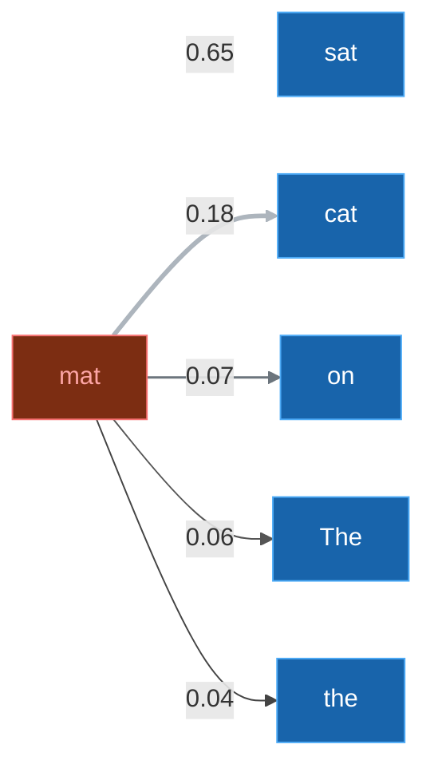
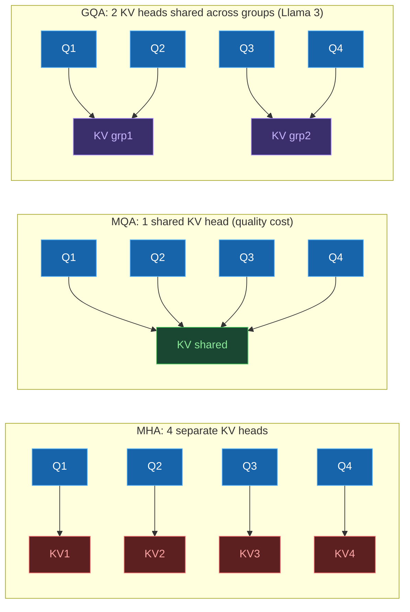

*Assumes familiarity with prefill, decode, and the KV cache. If those are new, start with the [Prefill & Decode](/blog/prefill-decode) and [KV Cache](/blog/kv-cache) posts.*

> **The 30-Second Version**: When a model card says "GQA with 8 KV heads," that's not an ML footnote. That number tells you how much GPU memory each concurrent user
  burns, and how many GPUs you need before tensor parallelism splits without waste. Deploying a GQA model instead of an MHA one can cut per-request KV cache by 8x.

## Attention is a memory budget problem

The model card tells you the attention variant (i.e. "Grouped-Query Attention" or "Sliding-Window Attention"). The `config.json` tells you the actual numbers. Here's Mistral-7B-v0.1's:


*Source: [huggingface.co/mistralai/Mistral-7B-v0.1/blob/main/config.json](https://huggingface.co/mistralai/Mistral-7B-v0.1/blob/main/config.json)*

`num_attention_heads: 32`, `num_key_value_heads: 8`, `sliding_window: 4096`. Those three fields are what determine your KV cache memory per request, the minimum GPU count for clean tensor parallelism splits, and your effective context window before memory pressure kicks in.

The model card labels are readable marketing. The config.json is the file you actually budget from.

## What attention actually computes

  Every token produces three vectors: a Query, a Key, and a Value. When generating the next token, the model computes a dot product between the current token's Query
  and every past token's Key, scales and normalizes those scores through a softmax, then takes a weighted sum of the Values. The KV cache stores past tokens' Keys and
   Values so they don't get recomputed on every decode step. This is the core mechanism from [Vaswani et al., 2017 ("Attention Is All You Need")](https://arxiv.org/abs/1706.03762).

Take a concrete example: predicting "mat" in "The cat sat on the mat." The model doesn't treat all prior tokens equally:



*Each arrow is an attention weight from "mat" to a prior token. All five weights sum to 1.0. "sat" gets the highest because it's the verb the preposition phrase anchors to.*


The KV cache is just the stored Keys and Values for all prior tokens so you don't recompute them at each decode step. That cache grows by one entry per generated token, per layer, per head.

A quick note on two terms used throughout. A **layer** (sometimes called a transformer block) is one full pass through the attention and feed-forward computation. Transformers stack many of these in sequence (Llama 2 70B has 80 of them), with each layer building a more abstract representation of the input. A **head** is a parallel instance of the Q/K/V attention computation within a single layer. Transformers don't run attention once per layer; they run it multiple times in parallel, each with its own Q, K, V weight matrices. Different heads tend to specialize: one might learn positional relationships, another syntactic structure, another semantic similarity. A model with 64 heads runs 64 separate Q/K/V projections per layer, then concatenates the results. Each head has its own K and V tensors to cache, and that's the multiplier in the memory formula.

MHA, MQA, and GQA are different answers to one question: how many of those heads get their own K/V cache?


## The four attention variants

This post covers four attention variants. Before diving into each:

| Variant | What it means |
|---|---|
| **MHA** (Multi-Head Attention) | Every attention head has its own Key and Value cache. Most memory-hungry. |
| **MQA** (Multi-Query Attention) | All query heads share a single K/V head. Lowest memory, quality cost. |
| **GQA** (Grouped-Query Attention) | Groups of query heads share a K/V head. Middle ground. Standard in modern open-source models. |
| **SWA** (Sliding Window Attention) | Each token only attends to the W most recent tokens. Caps KV cache growth at O(W) instead of O(N). |

Flash Attention is also discussed but it's not a separate variant. It's a kernel optimization that computes any of the above more efficiently.

## MHA: the expensive default

Multi-Head Attention caches one KV pair per head per layer. To see what that costs, take a hypothetical 70B-scale dense model with MHA: 80 layers, 64 heads, 128-dim heads, served in FP16.

```
KV cache = 80 layers × 64 heads × 128 dims × seq_len × 2 (K+V) × 2 bytes
         = ~10 GB at 4K context, per request
```

At 32K context that's ~80 GB per request. Fifty concurrent users would need 4 TB of KV cache alone, before you've even loaded model weights.

Worth noting: Llama 2 70B doesn't actually use full MHA. It ships with GQA (8 KV heads, not 64). The real KV cache for Llama 2 70B at 4K context is closer to ~1.3 GB per request. That contrast is exactly the point of the next section.

## GQA and MQA: sharing KV heads

MQA takes it to the logical extreme: one shared KV head for all query heads, per layer. Memory drops proportionally with query head count. The quality cost is real though, particularly on multi-step reasoning. Teams that deployed pure MQA at scale generally ran into quality complaints on harder queries, which is partly what motivated GQA. MQA was originally proposed by [Shazeer, 2019](https://arxiv.org/abs/1911.02150).

GQA is the compromise that stuck. Query heads are divided into groups, and each group shares one KV head. Llama 3 70B has 64 query heads and 8 KV heads, so instead of caching 64 KV pairs per layer, you cache 8. If Llama 3 70B used full MHA (64 KV heads), the KV cache at 4K context would be ~10 GB per request. With its actual GQA config (8 KV heads), that drops to ~1.3 GB. GQA was formally described in [Ainslie et al., 2023](https://arxiv.org/abs/2305.13245).



The quality difference between GQA and MHA is small enough that Llama 3, Mistral 7B, and Gemma 2 all ship with it. Benchmark degradation is minor. On standard chat traffic, the regression is hard to measure in practice.

## Tensor parallelism and the KV head constraint

Tensor parallelism shards attention heads across GPUs. MHA with 64 heads splits cleanly across 8 GPUs (8 heads each). With GQA you have 8 KV heads, and that's the binding constraint, not the 64 query heads. You need at least 8 GPUs for a clean partition. Try to run across 16 GPUs and each KV head has to be replicated to two cards, which eats back some of the memory savings.

When spec'ing GPU counts for a new model, the number to look at isn't total attention heads. It's KV heads. That's what sets the minimum clean TP degree. I've seen this catch teams off guard, especially when moving to a newer GQA architecture from a model they know well.

For very long contexts, context parallelism (Ring Attention) distributes the sequence itself across GPUs rather than the heads. The coordination overhead makes it worth it only above roughly 32K context. Below that, Flash Attention on a single well-provisioned node handles it.

## Flash Attention is not a model change

One thing to get straight before going further: Flash Attention doesn't change what the model computes. Same outputs as standard attention, every time. The difference is entirely about where the intermediate math lives.

Standard attention writes the full attention score matrix (Q × K^T) to HBM before applying softmax and multiplying by V. That matrix is quadratic in sequence length. For a 32K token sequence, the GPU spends most of its time on HBM reads and writes, not on the matrix math.

Flash Attention tiles Q, K, V into blocks sized to fit in SRAM (40MB on A100, 50MB on H100) and keeps the computation there entirely, never materializing the full score matrix in HBM. GPU utilization on attention layers can go from the 30-40% range with standard attention to over 70%. Contexts that would previously OOM become practical. [FlashAttention-2 (Dao, 2023)](https://arxiv.org/abs/2307.08691) extended this further, and FlashAttention-3 adds Hopper-specific warp specialization for H100s.

This is a kernel optimization inside your serving framework, not a model property. You don't pick a model with or without Flash Attention; you pick vLLM or SGLang, and it runs transparently.

## Sliding Window Attention and fleet sizing

Standard attention KV cache grows linearly with sequence length: longer context means proportionally more memory. At 128K tokens on a large model, the KV cache becomes the dominant cost, not the weights.

Sliding Window Attention (SWA) caps it. Each token only attends to the W most recent tokens. The KV cache stays at O(W) regardless of how long the sequence actually is. [Mistral 7B (Jiang et al., 2023)](https://arxiv.org/abs/2310.06825) uses W=4096. If you're running a model with SWA, you size your KV cache budget for W, not for the maximum context length. A fleet configured for 4K context can serve 128K input sequences without increasing GPU memory allocation.

What you give up is direct attention to tokens outside the window. Rolling buffer implementations handle this at the KV cache level, but queries about content from early in a long document can degrade. For most chat, customer support, and code assistant workloads (where relevant context is almost always in the last few thousand tokens), that's an acceptable trade. For long-document analysis or cross-document reasoning, it isn't.

## Hardware scorecard
Pulling this together across variants:

| Variant | KV Cache at 4K context (4,096 tokens) | KV heads (Tensor Parallelism partition constraint) | GPU Tier |
|---|---|---|---|
| MHA (64 KV heads) | ~10.7 GB/req | 64 (need 64 GPUs for clean split) | [H100](https://www.nvidia.com/en-us/data-center/h100/); bandwidth bottleneck at long context |
| GQA (8 KV heads, e.g. Llama 3 70B) | ~1.3 GB/req | 8 (minimum 8 GPUs for clean split) | [A100](https://www.nvidia.com/en-us/data-center/a100/) / [A10G](https://www.nvidia.com/en-us/data-center/products/a10-gpu/) workable |
| MQA (1 KV head) | Smallest | 1 KV head (KV partition needs 1 slot, but you can still run on many GPUs) | [L4](https://www.nvidia.com/en-us/data-center/l4/) tier viable |

A note on the "KV heads" column: this is the Tensor Parallelism (TP) partitioning constraint, not a GPU count minimum.

MQA has 1 KV head, meaning the KV partition fits on 1 GPU. You can still deploy MQA on 8 or 16 GPUs (the query heads split fine) but the KV cache doesn't gain from additional GPUs the way it does with MHA.

**SWA is orthogonal to this table.** Sliding Window Attention is not a peer to MHA/MQA/GQA. It's an independent choice about how far back each token can attend.

A model can use GQA and SWA at the same time. Mistral 7B is exactly that: GQA (8 KV heads) plus SWA (W=4096 window). SWA affects the KV cache size bound (O(W) instead of O(N)), not the per-head structure. So the TP constraints above still apply based on the base attention type.

**On CPU KV offload**: systems like [FlexGen](https://arxiv.org/abs/2303.06865) that spill KV cache to CPU DRAM are real, but the PCIe bus adds tens of milliseconds per token. Viable for offline batch summarization where throughput matters more than latency.

For real-time serving, this doesn't work. Your p95 latency SLO won't survive PCIe transfer times on every decode step. If you're hitting KV cache limits in production chat, the options worth considering are GQA model selection, KV cache quantization, or adding GPU memory, not offloading to CPU DRAM.

**On H100 vs A100 for decode**: The [H100](https://www.nvidia.com/en-us/data-center/h100/) uses HBM3 (High Bandwidth Memory, 3rd gen) with 3.35 TB/s bandwidth. The [A100](https://www.nvidia.com/en-us/data-center/a100/) uses HBM2e (High Bandwidth Memory 2, extended) at 2 TB/s. Since decode is memory-bandwidth-bound (the bottleneck is how fast you can pull model weights and KV cache from HBM, not compute), that bandwidth difference translates mostly linearly to tokens-per-second.

If you're on MHA with long context and paying for the large KV cache, you're paying the bandwidth cost on every single decode step too. In practice this is the clearest case for upgrading to H100: not compute-bound workloads, but specifically MHA at long context where both the cache size and the per-step bandwidth cost compound.

---

*Note: This blog represents my technical views and production experience. I use AI-based tools to help with drafting and formatting to keep these posts coming daily.*
