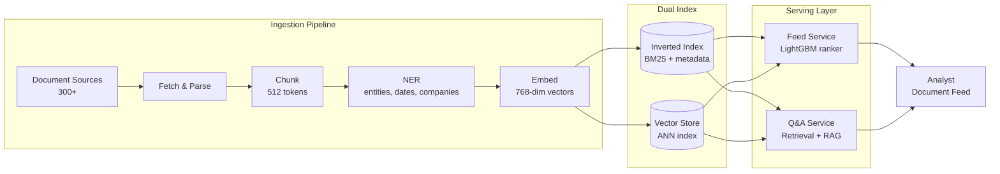
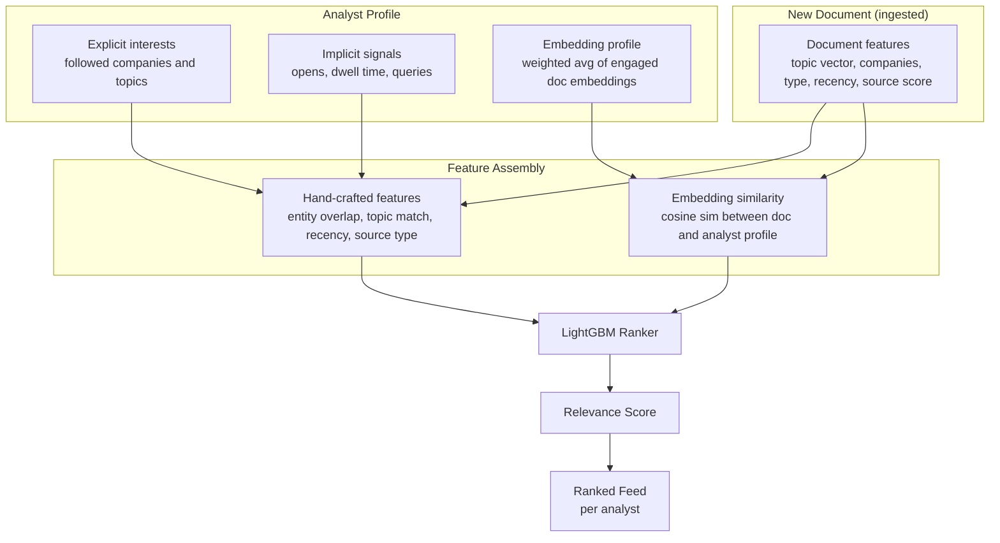
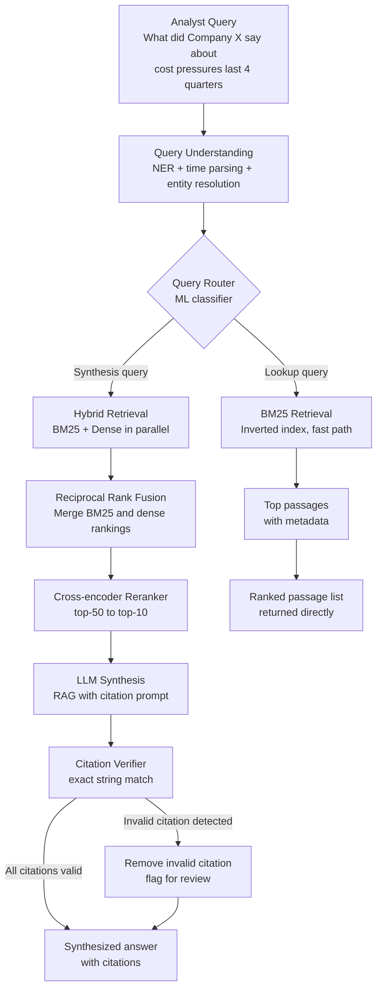
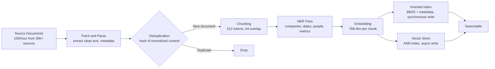
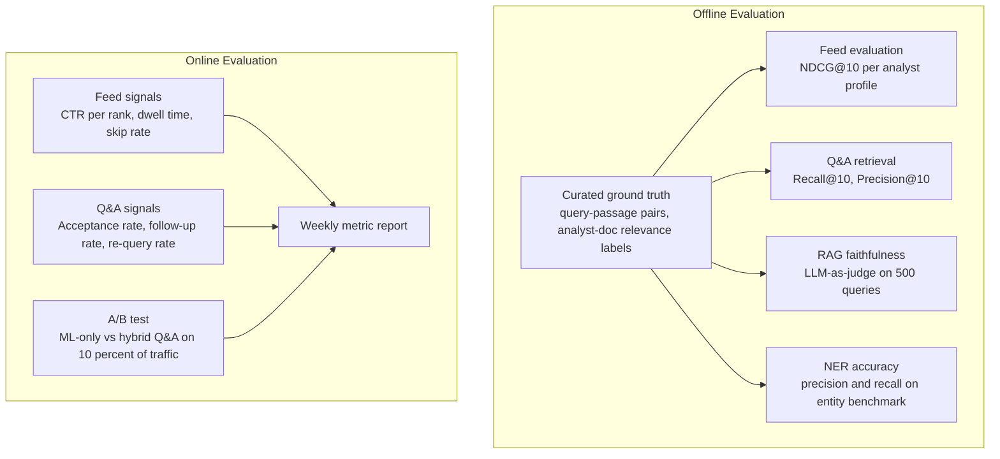

*This post applies the 9-step case study structure from the [GenAI System Design Framework](/blog/genai-system-design-framework) and also walks through the traditional ML system design process (problem exploration, data strategy, modeling, feature engineering, ML architecture, and evaluation) for the same problem. It is designed for engineers who want to see both paradigms applied to an identical problem and understand when and how to compose them.*

## Problem Statement

A research firm has analysts who track hundreds of companies. Every hour, 100 new documents arrive from 300+ sources: annual reports, quarterly updates, official announcements, research notes, and news articles. The total corpus is 500,000 documents and growing.

Two problems need solving. First, the volume of new content is too high to read manually. Analysts miss important updates because there is no signal about which of the 100 new documents arriving each hour actually matter to them. Second, when analysts need to answer a specific question like "What has this company said about cost pressures over the last four quarters?", there is no way to get a direct, sourced answer. They have to read through dozens of documents themselves.

The platform needs to solve both:

**Capability 1: Personalized Document Feed.** Show each analyst a ranked list of the documents they should read, ordered by relevance to their specific interests and coverage universe. The feed updates in real time as new documents arrive.

**Capability 2: Natural Language Q&A.** Let analysts ask plain English questions and get a synthesized answer with citations back to the source passages. Every claim in the answer must link to a specific document and passage.

**Primary users**: Analysts (50-200 active users) who read documents and run queries daily during business hours.

### What this system is not

It is not a trading or decision-making system. It surfaces information; it does not act on it.

It is not a general-purpose chatbot. Every answer the Q&A capability produces must trace back to a specific passage in the corpus. If no relevant passage exists, the system says so explicitly rather than generating a plausible-sounding answer from parametric memory.

It is not a document storage or compliance system. Ingestion is in scope; raw document retention, access control management, and legal holds are not.

It is not a replacement for analyst judgment. The feed surfaces what might be worth reading. The Q&A synthesizes what documents say. Neither system makes recommendations or draws conclusions.

## Step 0: Why Both ML and GenAI?

Most system design discussions frame this as a binary choice: build a rules-based system, a traditional ML system, or a GenAI system. The more useful question is which parts of the problem each paradigm handles well, and where you need both.

### Where ML wins

The document feed is a ranking and recommendation problem. You have structured signals: which documents an analyst opened, how long they spent on each, which companies they follow, what queries they ran. These signals are well-defined, dense enough to train on, and change incrementally. A gradient boosted tree trained on implicit feedback handles this well. It is fast at inference (under 1ms per document), cheap to run at scale, interpretable enough to debug, and benefits directly from analyst behavior data.

More importantly, the feed requires temporal awareness. A document about a company that was irrelevant two weeks ago might be highly relevant today because the company just reported earnings. Explicit recency features in an ML model capture this. A pure embedding-based approach cannot, because embeddings are computed at ingestion time and do not change when the relevance context shifts.

### Where GenAI wins

The Q&A capability has a component that ML fundamentally cannot handle: answer synthesis. An ML retrieval system can find the ten most relevant passages to a query. It cannot compose those passages into a coherent, cited answer that synthesizes information across four quarterly reports. That requires generative capability. Only an LLM can produce the output the analysts actually want.

GenAI also handles query understanding better in this domain. Company names come in dozens of forms. Financial terminology has extensive synonyms. A zero-shot language model handles entity resolution and synonym understanding better than a purpose-trained NER model on queries it has never seen before.

### Where you need both

Passage retrieval sits in the middle. BM25 keyword search is fast and has high precision on exact matches. Dense semantic retrieval catches paraphrase matches that BM25 misses. Neither alone gives you both. You need a hybrid retrieval layer that runs both in parallel and merges their results.

Citation verification is another hybrid case. The LLM generates an answer with citations, but LLMs can misattribute or subtly paraphrase in ways that create misleading citations. An exact string matching layer (pure ML/deterministic) verifies every citation before the response reaches the analyst. The GenAI generates; the ML guardrail verifies.

| Sub-problem | ML | GenAI | Verdict |
|---|---|---|---|
| Document feed ranking | Collaborative signals, recency, temporal context | No training signal for generative output, expensive per-doc | ML wins |
| Entity and synonym understanding in queries | NER works for known entities | Better zero-shot on unseen names and terminology | GenAI wins |
| Passage retrieval | BM25: fast, high precision on exact matches | Dense retrieval: semantic matches BM25 misses | Both (hybrid) |
| Answer synthesis across documents | Cannot compose across passages | Required: only LLMs can generate fluent cited answers | GenAI wins |
| Citation grounding | Exact string matching is deterministic and reliable | Cannot self-verify without structured output constraints | ML guardrail on GenAI |
| Cold start (new analyst, no history) | Weak: no interaction data | Better: seed from stated interests as embeddings | GenAI edge |

The thesis: use ML where you have structured signals and need speed or cost efficiency. Use GenAI where the task requires semantic understanding or generation that ML cannot produce. Compose them where neither alone is sufficient.

## Step 1: Requirements

### Functional requirements

**Document Feed:**
- Each analyst sees a ranked list of new and recent documents ordered by inferred relevance to them
- Relevance inferred from: documents opened, queries run, companies and topics explicitly followed, dwell time on documents
- Feed refreshes automatically as new documents are ingested
- Analyst can filter by company, topic, or document type; the default view is personalized

**Natural Language Q&A:**
- Analyst types a plain English question
- System searches the full 500K document corpus and returns a synthesized answer drawn from relevant passages
- Every sentence in the answer links to a specific source (document name, date, passage)
- Supports scoping: by company, by time range ("last 4 quarters"), by document type
- If no relevant passage exists in the corpus, the system returns an explicit "not found" response rather than generating an answer

### Non-functional requirements

- **Feed load time**: under 2 seconds for the personalized ranked list
- **Q&A latency**: first token streamed within 1 second, full answer within 5 seconds at P95
- **Retrieval recall**: over 90% on a curated ground-truth evaluation set
- **Hallucination rate**: under 2% on synthesized answers as measured by LLM-as-judge evaluation
- **Fabricated citations**: zero tolerance. Every cited passage must exist verbatim in the source document.
- **Cost per query**: under $0.05 end-to-end
- **Ingestion lag**: new documents searchable within 30 minutes of arrival
- **Availability**: 99.9% during business hours

### Scale assumptions

| Parameter | Value |
|---|---|
| Total corpus size | 500,000 documents |
| Active sources | 300+ |
| New documents per hour | 100 |
| Total tokens in corpus | ~5 billion |
| Concurrent analysts (peak) | 50-200 |
| Daily query volume | 10,000-50,000 |
| Analyst profiles | 200 |

### Quality metrics

| Metric | Target | How measured |
|---|---|---|
| Feed NDCG@10 | Over 0.70 | Offline eval on analyst-document relevance labels |
| Q&A retrieval Recall@10 | Over 90% | Held-out query-passage ground truth set |
| Citation accuracy | 100% | Exact string match verifier on all returned citations |
| RAG faithfulness | Over 98% | LLM-as-judge on 500 held-out queries weekly |
| Query resolution rate | Over 70% | Analyst used the answer without follow-up query |

### Trade-offs to acknowledge

| Dimension | Option A | Option B | Our choice |
|---|---|---|---|
| Feed ranking | Pure ML (fast, temporal-aware, interaction signals) | Pure embedding similarity (semantic, handles cold start) | Hybrid: ML ranker with embedding similarity as a feature |
| Q&A retrieval | BM25 only (fast, cheap, exact match) | Dense only (semantic, misses exact matches) | Hybrid: BM25 + dense, merged with RRF |
| Q&A response | Ranked passage list (ML, fast, no synthesis) | LLM synthesis (GenAI, full answer, higher cost and latency) | Query router: route based on query type |
| Embedding freshness | Re-embed on every update (accurate, expensive) | Embed once at ingestion (fast, stale for temporal queries) | Embed once; use ML features for temporal signals |

## Step 2: Architecture Overview

The platform has three layers: an ingestion pipeline, a dual index, and two serving services.



**Ingestion pipeline**: Every document that enters the system goes through the same four-stage pipeline: parse to extract clean text, chunk into 512-token segments with 64-token overlap, run NER to extract entities and metadata per chunk, and embed each chunk to produce a 768-dimensional vector. All four stages run for every document.

**Dual index**: Every chunk is written to both an inverted index (for BM25 and metadata-filtered search) and a vector store (for dense ANN retrieval). The inverted index write is synchronous. The vector store write is asynchronous and eventually consistent, which is acceptable because dense retrieval does not need to be real-time.

**Feed service**: Consumes the dual index to rank new documents per analyst. Runs a LightGBM ranker with both hand-crafted features and embedding similarity as inputs.

**Q&A service**: Routes queries to BM25-only retrieval (for lookup queries) or hybrid retrieval with LLM synthesis (for synthesis queries). Runs a citation verifier before returning any response.

The two services share the dual index but have no other dependencies on each other. Different latency requirements, different scaling patterns, different failure modes.

## Step 3: Capability 1: Personalized Document Feed



### V1: ML approach

The feed is a ranking problem. Given a new document and an analyst's profile, predict a relevance score. The standard approach is learning-to-rank with a gradient boosted tree.

**Why LightGBM**: Fast at inference (under 1ms per document-analyst pair), handles sparse and dense features together, interpretable enough to debug ("why is this document ranked highly?"), and retrains quickly on weekly batches of implicit feedback.

**Document features:**
- Topic vector: a multi-label classifier assigns topic probabilities across 50 topic categories (supply chain, cost structure, product launches, regulatory risk, etc.). Each document gets a sparse topic vector.
- Companies mentioned: output of the NER pass. A document mentioning three specific companies carries different relevance depending on whether the analyst follows those companies.
- Document type: earnings call, annual report, news article, research note. Analysts have strong preferences about document types.
- Source credibility score: a hand-tuned score per source based on historical analyst engagement rates. Analysts at this firm reliably open documents from some sources and ignore others.
- Recency: days since publication, with a decay function. A document from this morning is more valuable than the same document from three months ago, all else equal.

**Analyst profile features:**
- Followed companies: explicit list the analyst manages in their profile settings.
- Topic engagement: weighted distribution over the 50 topic categories based on documents opened in the last 90 days. An analyst who has read 40 documents about supply chain logistics in the last month has a strong supply chain signal.
- Document type preference: ratio of each document type opened. Some analysts read only research notes; others read everything.
- Query history: topics and companies that appear frequently in the analyst's recent Q&A queries. A query is a strong signal of active interest.

**Interaction features:**
- Entity overlap: fraction of companies in the document that appear in the analyst's followed list or recent query history.
- Topic match score: dot product of the document's topic vector and the analyst's topic engagement vector.
- Historical engagement with this source: has the analyst opened documents from this source before, and at what rate?

**Training data:**
- Positive examples: (analyst, document) pairs where the analyst opened the document and dwell time exceeded 30 seconds.
- Weak negatives: documents the analyst was shown (appeared in feed) but did not open.
- Hard negatives: documents from sources the analyst actively follows but chose not to open.
- Label: a continuous relevance score combining open binary + dwell time percentile + re-open (reading a document twice is a strong signal).

**Retraining cadence**: weekly, on the last 90 days of interaction data. The model is not sensitive to daily distribution shifts. A weekly retrain keeps the topic engagement profiles fresh.

**Cold start handling**: A new analyst has no interaction history. Fallback: use only the entity overlap feature (document mentions companies the analyst follows) and source credibility score. The cold start feed is less personalized but functional. After the analyst opens 10-20 documents, the interaction features become informative enough to dominate.

**Serving**:
- At ingestion time, for every new document, run the ranker for all 200 analyst profiles. 200 inferences at under 1ms each = 200ms total. Easily keeps up with 100 documents per hour.
- Store the pre-ranked scores per analyst per document in a low-latency key-value store.
- At feed load time, the serve call is a lookup + sort: retrieve the analyst's top-N scored documents and return the ranked list. Under 50ms.

**Where V1 breaks down**: The topic classifier and entity overlap features rely on exact vocabulary matches. "Cost pressures" and "margin compression" are different topic labels unless the classifier was explicitly trained on both. An analyst who has engaged with supply chain documents will not see semantically related documents about "inventory buffer optimization" unless the classifier happens to assign both to the same topic bucket. The model is constrained by the vocabulary of its features.

The second limitation is cold start depth. An analyst with a stated coverage list but no interaction history gets a feed based only on company mentions and source credibility. That feed is reasonable but shallow. It cannot infer that an analyst who follows semiconductor companies probably cares about ASML even if they have not explicitly followed ASML yet.

### V2: GenAI evolution

Replace the topic classifier with document embeddings. Instead of mapping documents to a fixed set of topic labels, embed every document chunk into a 768-dimensional vector space where semantic similarity determines closeness. "Cost pressures" and "margin compression" land near each other in this space. "Supply chain resilience" and "inventory buffer strategy" are close neighbors.

**Analyst profile embedding**: Compute a weighted average of the embeddings of all documents the analyst has engaged with, weighted by dwell time. An analyst who spent 20 minutes on a document about TSMC's capacity expansion has a profile vector pulled strongly in that direction. Documents with similar embeddings rank higher.

**Cold start improvement**: For a new analyst, initialize the profile embedding as the centroid of embeddings of documents about their stated followed companies and topics. This gives a reasonable starting point without any interaction history.

**Where V2 adds value over V1**:
- Semantic generalization: an analyst interested in semiconductor equipment will see documents about lithography advances, fab capacity, and yield improvement without having explicitly engaged with each sub-topic.
- Cold start is meaningful from day one: the seed embedding is semantically rich, not just an entity list.
- No need to maintain a topic taxonomy. The embedding space is learned from the corpus, not hand-engineered.

**Where V2 has limits**: Embeddings are static once computed at ingestion time. They capture the semantic content of the document but not its current relevance given external context. An earnings call from six months ago that discussed margin pressure becomes highly relevant today if the company just issued a profit warning that references those same pressures. The embedding similarity score does not change. The ML model with an explicit recency feature does respond to this.

### Hybrid composition

The two approaches are not alternatives. They are complementary signals.

Use the LightGBM ranker as the primary ranking model. Add embedding similarity (cosine similarity between the new document's chunk embeddings and the analyst's profile embedding) as an additional feature alongside the hand-crafted features. The ranker learns the right weight to give embedding similarity versus entity overlap versus recency in context.

In practice: embedding similarity is a strong signal for cold start analysts (high weight because other features are weak) and a supplementary signal for experienced analysts (moderate weight because interaction features are more predictive). The ranker learns this from the training data without you having to specify it manually.

The result: a feed that handles semantic generalization (from the embedding feature), temporal relevance (from the recency and interaction features), and company coverage (from entity overlap) all in a single model.

## Step 4: Capability 2: Natural Language Q&A



### V1: ML approach

The Q&A system starts as an information retrieval problem. Given a query, find the most relevant passages. Return them ranked by relevance. The analyst reads the top results and synthesizes their own answer.

**Query understanding**:

Before retrieval, parse the query to extract structured signals:

- Named entity recognition: identify company names, executive names, product names. "What did Company X say" tells you to filter the corpus to documents about Company X.
- Time range extraction: "last 4 quarters" maps to a date range filter. "In 2024" maps to another. This filter is applied at the BM25 retrieval step.
- Query expansion: a synonym model trained on the corpus vocabulary expands the query terms. "Cost pressures" expands to include "margin compression", "input cost headwinds", "COGS pressure", "cost of goods sold increases". This expansion improves recall from the inverted index without false precision degradation.

**Retrieval**:

BM25 search over the inverted index with the expanded query. The company and date range filters from query understanding are applied as hard constraints. Return the top 50 passages by BM25 score.

**Reranking**:

A learning-to-rank model (LightGBM) re-ranks the top 50 passages. Features include:
- BM25 score of the passage against the original query
- BM25 score of the passage against the expanded query
- Passage length (very short passages are often fragments)
- Document recency (more recent documents ranked higher for time-sensitive queries)
- Entity overlap between query entities and passage entities
- Source type weight (research notes score higher for analytical queries; news scores higher for event queries)

**Response**:

Return the top 5 ranked passages with document name, date, and the passage text. The analyst reads them and synthesizes their own answer.

**Where V1 breaks down**:

| Query type | What V1 returns | What the analyst actually needs |
|---|---|---|
| "Find documents about supply chain" | Ranked list of relevant documents | Ranked list of documents (V1 works) |
| "What did Company X say about cost pressures?" | Top 5 passages mentioning cost pressures | A synthesized answer: "In Q1 they said X, in Q2 they said Y..." |
| "How has management's tone on margins changed over 4 quarters?" | Passages from 4 quarters, unsorted | A synthesis that explicitly compares the language across quarters |
| "Compare Company X and Company Y on AI investment" | Two separate sets of passages | A side-by-side comparison drawn from both |

The fundamental limitation: V1 retrieves and ranks. It cannot compose. Multi-document synthesis, temporal comparison, and cross-company analysis all require reading and reasoning across multiple passages, which is a generative task.

### V2: GenAI evolution

Add two capabilities to V1: dense retrieval to improve recall, and LLM synthesis to produce direct answers.

**Dense retrieval**:

Embed the analyst's query using the same embedding model used for document chunks. Run approximate nearest neighbor search in the vector store. This returns passages that are semantically related to the query even when they do not share vocabulary.

Example: "What did management say about headcount?" retrieves passages containing "workforce reduction", "employee count", "head count optimization", and "staffing levels", none of which contain the word "headcount". BM25 misses all of them. Dense retrieval catches them.

**Hybrid retrieval with Reciprocal Rank Fusion**:

Run BM25 and dense retrieval in parallel. Merge the two ranked lists using Reciprocal Rank Fusion (RRF). The merged rank of each passage is:

merged_score = 1 / (k + rank_bm25) + 1 / (k + rank_dense)

where k is a smoothing constant (typically 60). This formula rewards passages that rank highly in both lists and is robust to score scale differences between BM25 and cosine similarity. Hybrid retrieval consistently outperforms either retrieval method alone on recall@10.

**Cross-encoder reranking**:

The top 50 passages from the merged list are re-ranked by a cross-encoder model. Unlike bi-encoder models (which encode query and passage independently), a cross-encoder sees the (query, passage) pair together and scores their relevance jointly. Cross-encoders are more accurate rerankers but too slow to run on the full corpus. Running them only on the top 50 keeps latency manageable.

**Answer synthesis with RAG**:

The top 10 passages after reranking are assembled as context for the LLM. The prompt structure:

- System: "You are a research assistant. Answer the question using only the provided passages. Cite every claim with [source_id]. If a claim cannot be supported by a passage, do not make it."
- Context: the 10 retrieved passages, each labeled with a source_id
- Query: the analyst's original question

The LLM generates a structured response: an answer in prose, with inline citations in the format [Document Name, Date, Passage ID].

**Model selection**:

The synthesis task routes to one of two models based on query complexity. The query router classifies queries into three tiers:

- Lookup queries: no LLM. BM25 only, under 500ms.
- Simple factual queries ("when did X happen", "what number did management give for Y"): a smaller, faster model handles these. A 7-8B parameter instruction-tuned model (Llama 3 8B Instruct, Gemini Flash, Claude Haiku) can extract and cite a single fact from a short passage with low latency (under 1 second) and negligible cost (under $0.01 per query).
- Synthesis queries ("compare X and Y", "how has this changed across four quarters", "summarize management's position on Z"): a larger model is required. These queries ask the model to read across 8-10 passages, identify relevant information in each, reconcile conflicting statements, and compose a coherent narrative. A frontier model (GPT-4o, Claude Sonnet, Gemini Pro) performs meaningfully better on multi-document synthesis than a smaller model. Budget $0.03-0.05 per query at this tier.

The quality gap between small and large models is most visible on synthesis queries requiring temporal comparison. Asking "how has management's tone on gross margin changed from Q1 to Q4?" requires the model to: (1) identify relevant passages in each quarter, (2) characterize the tone in each, (3) compare the characterization across quarters, and (4) write a coherent narrative. Smaller models tend to miss steps 2 and 3, producing answers that list passages without synthesizing the comparison.

**Fine-tuning decision**:

Fine-tune the embedding model, not the synthesis LLM. Here is the reasoning:

The embedding model is used for retrieval. Its job is to map financial text into a vector space where semantically related passages are close together. A general-purpose embedding model (E5-large, BGE-large) trained on web text will under-perform on financial terminology: "organic revenue growth", "adjusted EBITDA", "management guidance", "headcount reductions for efficiency" all have specific meanings in this domain that a general model may not capture well. Fine-tuning the embedding model on a corpus of financial documents using contrastive learning (pairs of semantically related passages as positives, random passages as negatives) measurably improves Recall@10 for financial queries.

The synthesis LLM does not need fine-tuning for this use case. Fine-tuning is valuable when you want to change the model's behavior across all inputs (format compliance, tone, task-specific output structure). Here the synthesis task is fully specified by the prompt and context on each call. The model sees the retrieved passages, the query, and the instruction to cite everything. The task varies per query; it does not have a single fixed format or behavior pattern worth baking in. Fine-tuning the synthesis LLM would cost significant compute, introduce a retraining pipeline to maintain, and provide marginal benefit over a well-designed system prompt.

One exception: structured output format. If the LLM consistently produces citations in inconsistent formats (sometimes `[DocName, Date]`, sometimes `(Source: DocName)`), consider fine-tuning a small adapter on 500-1000 examples of correctly formatted responses. But in practice, enforcing JSON mode or structured output through the inference API solves this more cheaply.

**Context window and prompt design**:

The 10 retrieved passages after reranking average 512 tokens each. Total context: roughly 5,000 tokens. Add the system prompt (200 tokens), query (50 tokens), and expected output with citations (500-800 tokens), and the full prompt sits comfortably within a 16K context window. Most frontier models offer 128K context, so the limit is not a constraint at this scale.

For synthesis queries that span multiple time periods ("last 4 quarters"), the system retrieves passages distributed across the time range. The prompt explicitly instructs the model to handle temporal synthesis:

```
System: You are a research assistant. The retrieved passages are organized by date.
For temporal comparison questions, identify the relevant data from each time period first,
then synthesize how it has changed. Cite every claim with [source_id].
Do not add information not present in the provided passages.
```

This structured reasoning instruction (identify per-period first, then synthesize) reduces the rate of answers that collapse four quarters of data into a single undifferentiated summary. It is not chain-of-thought in the extended sense, but it gives the model an explicit reasoning order that improves output quality on multi-step synthesis queries without adding latency.

For queries that are ambiguous (query scope not clear from the text alone), the prompt includes the analyst's active filters (company scope, date range, document types) as additional context. This prevents the model from reasoning about the full corpus when the analyst has already narrowed the scope.

**Citation verifier (ML layer on GenAI output)**:

Before the response reaches the analyst, every citation in the LLM's answer is verified:

1. Extract all citation references from the LLM output
2. For each citation, look up the referenced passage by source_id
3. Verify that the cited claim appears verbatim or as a clear paraphrase in the passage
4. If the citation does not match: remove it from the response and flag it in the monitoring system

This deterministic verification layer enforces the zero-fabricated-citations requirement. The LLM is constrained by the retrieved context, and the verifier confirms that citations in the output actually trace back to real passages.

**Query router**:

Not all queries need the full RAG pipeline. A simple ML classifier (logistic regression on query text features) routes each query:

- Lookup queries ("find documents about X", "show me filings from Company Y in Q3"): route to BM25-only retrieval, return ranked passage list. No LLM call. Under 500ms, negligible cost.
- Synthesis queries ("what did management say about X", "compare X and Y", "how has X changed"): route to hybrid retrieval + LLM synthesis. Under 5 seconds, under $0.05 per query.

When the router is uncertain (confidence below 0.7), default to the synthesis path. A slightly over-engineered response to a simple query costs $0.05. A ranked passage list returned for a synthesis query frustrates the analyst and sends them to re-query. The asymmetry favors the synthesis path.

| Query type | Route | Latency | Cost per query |
|---|---|---|---|
| Lookup ("find documents about X") | BM25 only | Under 500ms | Under $0.002 |
| Factual Q&A ("when did X happen") | Dense + small LLM | Under 2 seconds | Under $0.01 |
| Synthesis query ("compare X and Y") | Hybrid retrieval + large LLM | Under 5 seconds | Under $0.05 |
| Bulk batch extraction | Async pipeline | Minutes (async) | Under $0.001 per doc |

## Step 5: Ingestion Pipeline

Every document that enters the system runs through the same four-stage pipeline. At 100 documents per hour, this is 1.67 documents per minute, well within the capacity of a single pipeline worker.



**Parsing**: Each source has its own format. The parser normalizes to clean text plus structured metadata (document type, source name, publication date, company identifiers). Parsing is source-specific but the downstream pipeline is source-agnostic.

**Deduplication**: Before any processing, compute a hash of the normalized document content. If the hash exists in the corpus, drop the document. If a document is an amendment (same document_id, different content), replace the previous version and re-process the updated content.

**Chunking**: Split each document into 512-token chunks with a 64-token overlap between adjacent chunks. The overlap prevents information loss at chunk boundaries: if a key sentence spans the end of one chunk and the beginning of the next, it appears in both, ensuring at least one chunk captures it fully. Each chunk stores a pointer to its document and its position within the document.

**NER pass**: Run named entity recognition on each chunk. Extract company names (normalized to a canonical identifier), executive names, dates, financial metrics (revenue, margins, headcount, guidance), and topic classifiers. Store all extracted entities as chunk metadata. This metadata serves two purposes: fast metadata-filtered retrieval at query time, and feature generation for the feed ranker.

**Embedding**: Embed each chunk using the domain-specific embedding model. Store the 768-dimensional vector alongside the chunk. For a 500,000-document corpus with an average of 10 chunks per document, this is 5 million vectors of 768 dimensions each, roughly 15 GB in float32. A moderately sized vector store handles this comfortably.

**Dual write**: The inverted index write is synchronous. The document is not marked as searchable until the inverted index write completes. The vector store write is asynchronous. A document may be available for BM25 retrieval before it appears in dense retrieval. This is acceptable: the BM25 path handles time-sensitive queries, and the dense retrieval path catching up within minutes is not a meaningful latency degradation.

**SLA**: Target 30 minutes from source availability to searchable. The pipeline processing time per document (parse, chunk, NER, embed) is under 2 minutes for a typical 10-page document on a single CPU worker. The remaining 28 minutes of buffer handles source fetch delays and index propagation.

## Step 6: Evaluation

Evaluation runs on two tracks: offline against ground truth, and online against analyst behavior.



### ML evaluation

**Feed**: Measure NDCG@10 on a held-out set of analyst-document relevance labels. These labels are collected by showing a random sample of analysts documents and asking them to rate relevance on a 1-5 scale. Expensive to collect but the ground truth for offline evaluation. Target: NDCG@10 over 0.70. A score of 0.70 means the feed is surfacing relevant documents in the top 10 positions with significantly better-than-random ordering.

**Q&A retrieval**: Measure Recall@10 on a curated set of query-passage pairs. These pairs are created by having senior analysts identify the passages they would cite to answer 200 representative queries. Recall@10 measures whether those target passages appear in the top 10 retrieved results. Target: over 90%. Missing a relevant passage in the top 10 means the LLM synthesis step does not have the information to answer correctly.

**NER**: Measure precision and recall on a domain entity benchmark. Precision failures (extracting a non-entity as an entity) pollute the metadata filters. Recall failures (missing a real entity) break the company-scoped filtering in Q&A.

### GenAI evaluation

**RAG faithfulness**: For 500 held-out queries, use an LLM-as-judge to evaluate whether each claim in the synthesized answer is supported by the cited passage. The judge model is different from the synthesis model (use a larger model to evaluate the output of a smaller one). Run this weekly. A faithfulness rate below 98% indicates the synthesis prompt needs tightening or the retrieval quality has degraded.

**Citation accuracy**: The citation verifier runs in production on every response. Monitor the fraction of citations that fail verification. Target: 0%. Any non-zero rate means the LLM is generating citations that do not trace back to real passages.

**Answer completeness**: Monthly human evaluation on 100 randomly sampled Q&A responses. Analysts score whether the response fully addressed the question, partially addressed it, or missed the key point. This is the only way to catch cases where retrieval succeeds (relevant passages are found) but synthesis fails (the LLM does not extract the right information from them).

### Online evaluation

**Feed**: Track click-through rate per rank position. A well-calibrated feed should have CTR declining smoothly from rank 1 to rank 10. A flat CTR across positions indicates the ranker is not effectively differentiating. Track dwell time per document (under 10 seconds = likely a false positive, the analyst glanced and moved on).

**Q&A**: Track acceptance rate: the fraction of Q&A responses the analyst uses without issuing a follow-up query or rephrasing the original question. A high follow-up rate signals incomplete or confusing answers. Track re-query rate specifically: did the analyst ask a semantically similar question within 5 minutes, suggesting the first answer was not satisfactory?

**A/B test rollout**: When adding the LLM synthesis layer to V1 (moving from ranked passage list to synthesized answers), run the new path on 10% of synthesis queries. Primary metric: query resolution rate (analyst found their answer without further queries). Secondary metric: session length (does the synthesized answer reduce total session time or extend it by prompting more queries?). Run for 2 weeks with 95% statistical significance threshold before full rollout.

## Failure Modes

**Embedding model staleness**: The embedding model is trained on a corpus snapshot. New terminology that enters the corpus after the model's training cutoff gets poorly embedded. "Quantum dot display" will not cluster near "mini-LED display" if the model was trained before quantum dot became common in the domain. This causes silent retrieval failures: the dense retrieval path simply misses semantically related passages. Mitigation: monitor query-passage cosine similarity distributions monthly. A downward shift indicates the model is drifting from the current corpus vocabulary. Refresh the embedding model quarterly and re-embed the entire corpus.

**LLM synthesis misinterpretation**: The citation verifier catches fabricated citations (claims that cite passages that do not exist). It does not catch accurate citations that are misinterpreted. An LLM can cite a passage saying "margins improved by 2 basis points" and summarize it as "significant margin improvement." The citation is technically correct; the characterization is misleading. Mitigation: the LLM-as-judge faithfulness evaluation catches this pattern. When faithfulness scores drop, review the flagged examples and adjust the synthesis prompt.

**New source integration failures**: When a new source is added to the 300+ list, its document format may differ from existing sources in ways the parser does not handle. NER may fail to extract entities. Chunks may be malformed. These failures are silent: the documents enter the corpus and appear searchable, but their metadata is incomplete and their retrieval quality is degraded. Mitigation: monitor NER hit rate, average chunk size, and entity density per source for the first 30 days after onboarding a new source. Alert if these metrics are more than 2 standard deviations below the corpus average.

**Query router misclassification**: A synthesis query classified as a lookup query returns a ranked passage list instead of a synthesized answer. The analyst does not get what they need and re-queries or abandons. Mitigation: set the router confidence threshold at 0.7. Below that threshold, route to the synthesis path regardless of classification. Review router errors weekly by sampling 20 misclassified queries and retraining the router classifier monthly on the corrected labels.

**Feed feedback loop**: The feed ranker is trained on analyst behavior, which is partly driven by the feed itself. If the ranker learns that analysts click documents from Source A, it surfaces more documents from Source A, which means analysts see more documents from Source A, which generates more positive signals for Source A. This is a classic feedback loop. Mitigation: include a 5% exploration slot in the feed: documents sampled at random from the full corpus rather than from the ranker's top results. These exploration slots generate unbiased signal for the retraining pipeline and prevent the ranker from collapsing to a small set of sources.

## Operational Concerns

### Monitoring

| Metric | What it tells you | Alert threshold |
|---|---|---|
| Feed NDCG@10 (offline, weekly) | Feed quality against ground truth | Drop of over 0.05 from baseline |
| Q&A Recall@10 (offline, weekly) | Retrieval quality for synthesis queries | Below 88% |
| Citation verifier failure rate | LLM generating unsupported citations | Any non-zero sustained rate |
| RAG faithfulness (weekly LLM-as-judge) | LLM synthesis quality | Below 97% |
| Query resolution rate (online, daily) | End-to-end Q&A usefulness | Below 65% |
| Ingestion lag P95 | Pipeline health | Over 45 minutes |
| Vector store write lag | Async indexing backlog | Over 60 minutes behind inverted index |
| Source NER hit rate | New source integration health | Below corpus average minus 2 standard deviations |

### Cost breakdown

| Component | Monthly cost (50K queries/day) | Notes |
|---|---|---|
| LLM inference (synthesis queries, ~30% of volume) | $2,000-4,000 | 15K synthesis queries/day at $0.03-0.08 each |
| Embedding model (ingestion, 100 docs/hour) | Under $200 | 5M chunk embeddings at ingestion; amortized |
| Vector store hosting | $300-600 | 5M vectors at 768 dims, ANN index |
| Inverted index hosting | Under $100 | Standard Elasticsearch or OpenSearch instance |
| Feed ranker inference | Under $50 | LightGBM at under 1ms per inference |
| Total | ~$2,700-5,000/month | Dominated by LLM inference |

The cost driver is LLM synthesis. Routing 70% of queries to the BM25-only path (lookup queries) keeps LLM costs proportional to actual synthesis demand rather than total query volume.

### Rollout strategy

**Phase 1 (weeks 1-6): ML-only baseline**
Deploy feed + Q&A using ML-only components. Feed uses LightGBM ranker with hand-crafted features. Q&A uses BM25 + learning-to-rank returning a ranked passage list. No LLM. Establish baseline metrics: NDCG@10 for feed, Recall@10 for Q&A, analyst satisfaction via monthly survey.

**Phase 2 (weeks 7-12): Add GenAI to Q&A**
Add dense retrieval, hybrid retrieval with RRF, cross-encoder reranking, and LLM synthesis. Run the query router. Roll out to 10% of synthesis queries in an A/B test. Measure query resolution rate vs. the ranked passage list baseline. If resolution rate improves by over 15 percentage points with no significant increase in latency, promote to 100%.

**Phase 3 (months 4+): Add semantic signals to feed**
Add document and analyst profile embeddings as features in the LightGBM feed ranker. Measure NDCG@10 on the held-out evaluation set before and after. Monitor cold start performance for new analysts specifically. Evaluate the embedding model refresh cadence based on corpus vocabulary drift signals.

## Going Deeper

**Cross-encoder reranking depth**: The cross-encoder reranker described here uses a standard sequence-pair classification architecture. A more powerful alternative is ColBERT [[5]](#ref-5), which uses late interaction between query and passage token embeddings. ColBERT has higher recall than cross-encoders and is faster because it pre-computes passage representations offline. For a corpus growing to several million documents, ColBERT's serving characteristics are worth evaluating.

**Personalized query expansion**: The query expansion model in V1 uses a corpus-wide synonym dictionary. A more powerful version uses the analyst's profile to personalize expansion: an analyst who covers semiconductor companies will get different expansions for "supply constraints" than an analyst covering consumer packaged goods. The analyst profile embedding provides the context signal for personalized expansion.

**Multi-hop reasoning**: Some analyst queries require chaining facts across documents. "Which companies that mentioned supply chain disruption in Q1 subsequently reported margin compression in Q2?" This is a two-hop query: first retrieve documents about supply chain disruption in Q1, then check whether the same companies appeared in margin compression documents in Q2. Single-pass RAG cannot handle this. Multi-hop reasoning requires either an agentic loop (retrieve, analyze, formulate a follow-up query, retrieve again) or a structured query decomposition layer upstream of retrieval.

**Feedback loops in the feed ranker**: Covered in failure modes, but worth emphasizing for interview depth. The exploration slot (5% random sampling) is necessary but not sufficient. The ranker's training data is observational, not experimental. An analyst who reads supply chain documents because the feed keeps surfacing them is not evidence that they are intrinsically interested in supply chain. Causal inference techniques (inverse propensity scoring, doubly robust estimation) applied to the implicit feedback labels produce less biased training data and more stable rankers.

**Passage-level vs document-level embeddings**: The system embeds at the passage level (512-token chunks). Document-level embeddings (one vector per document) are cheaper to store and faster to search but lose the ability to retrieve specific passages. For a Q&A system that needs to cite specific passages, chunk-level embeddings are necessary. For a feed system that ranks whole documents, document-level embeddings are sufficient. Running two embedding granularities (chunk for Q&A, document for feed similarity feature) reduces storage by roughly 10x for the feed use case.

**Cost optimization through query caching**: A significant fraction of Q&A queries are semantically similar. Different analysts asking "What did Company X say about margins this quarter?" will generate near-identical retrieval results and synthesis prompts. Caching at the retrieval result level (cache the top-10 passages for a query embedding cluster) avoids redundant LLM calls without sacrificing freshness. Implement with a similarity threshold: if an incoming query embedding is within cosine distance 0.05 of a cached query, return the cached synthesis result. Invalidate the cache when new documents are ingested for the referenced company.

## References

1. <a id="ref-1"></a>[Robertson and Zaragoza - The Probabilistic Relevance Framework: BM25 and Beyond (2009)](https://dl.acm.org/doi/10.1561/1500000019) - Foundational BM25 paper
2. <a id="ref-2"></a>[Ke et al. - LightGBM: A Highly Efficient Gradient Boosting Decision Tree (2017)](https://papers.nips.cc/paper/2017/hash/6449f44a102fde848669bdd9eb6b76fa-Abstract.html) - LightGBM for learning-to-rank
3. <a id="ref-3"></a>[Lewis et al. - Retrieval-Augmented Generation for Knowledge-Intensive NLP Tasks (2020)](https://arxiv.org/abs/2005.11401) - Foundational RAG paper
4. <a id="ref-4"></a>[Wang et al. - Text Embeddings by Weakly-Supervised Contrastive Pre-training (E5, 2022)](https://arxiv.org/abs/2212.03533) - E5 embedding model
5. <a id="ref-5"></a>[Khattab and Zaharia - ColBERT: Efficient and Effective Passage Search via Contextualized Late Interaction (2020)](https://arxiv.org/abs/2004.12832) - ColBERT for dense retrieval
6. <a id="ref-6"></a>[Cormack et al. - Reciprocal Rank Fusion Outperforms Condorcet and Individual Rank Learning Methods (2009)](https://dl.acm.org/doi/10.1145/1571941.1572114) - RRF for hybrid retrieval
7. <a id="ref-7"></a>[Nogueira and Cho - Passage Re-ranking with BERT (2019)](https://arxiv.org/abs/1901.04085) - Cross-encoder reranking
8. <a id="ref-8"></a>[Es et al. - RAGAS: Automated Evaluation of Retrieval Augmented Generation (2023)](https://arxiv.org/abs/2309.15217) - RAG evaluation framework
9. <a id="ref-9"></a>[Järvelin and Kekäläinen - Cumulated Gain-Based Evaluation of IR Techniques (2002)](https://dl.acm.org/doi/10.1145/582415.582418) - NDCG metric
10. <a id="ref-10"></a>[Kwon et al. - Efficient Memory Management for LLM Serving with PagedAttention (2023)](https://arxiv.org/abs/2309.06180) - vLLM serving
11. <a id="ref-11"></a>[Weaviate Documentation](https://weaviate.io/developers/weaviate) - Vector store reference
12. <a id="ref-12"></a>[Qdrant Documentation](https://qdrant.tech/documentation/) - Vector store reference
13. <a id="ref-13"></a>[Joachims - Optimizing Search Engines Using Clickthrough Data (2002)](https://dl.acm.org/doi/10.1145/775047.775067) - Implicit feedback for ranking
14. <a id="ref-14"></a>[Bottou et al. - Counterfactual Reasoning and Learning Systems (2013)](https://arxiv.org/abs/1209.2355) - Causal inference for ranking feedback loops
15. <a id="ref-15"></a>[Zhao et al. - Dense Passage Retrieval for Open-Domain Question Answering (DPR, 2020)](https://arxiv.org/abs/2004.04906) - Dense retrieval fundamentals
16. <a id="ref-16"></a>[Zhu et al. - Large Language Models for Information Retrieval: A Survey (2023)](https://arxiv.org/abs/2308.07107) - LLMs for IR survey
17. <a id="ref-17"></a>[OpenSearch Documentation](https://opensearch.org/docs/latest/) - Inverted index and BM25 at scale
18. <a id="ref-18"></a>[Elasticsearch Learning to Rank Plugin](https://elasticsearch-learning-to-rank.readthedocs.io/en/latest/) - LTR in production search

---

*Note: This blog represents my technical views and production experience. I use AI-based tools to help with drafting and formatting to keep these posts coming daily.*
