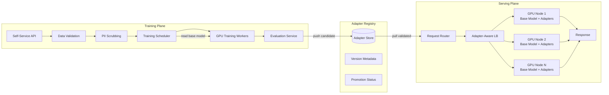
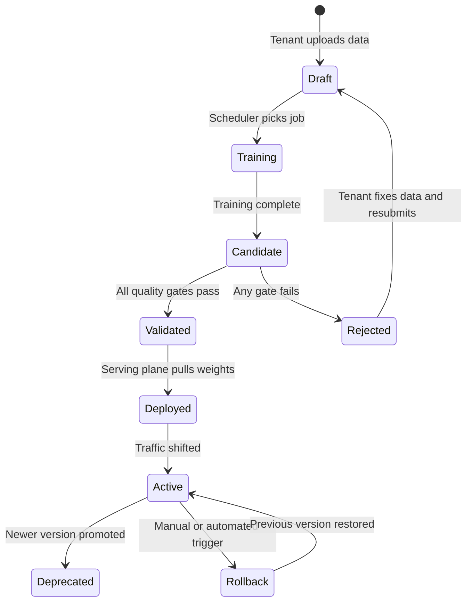
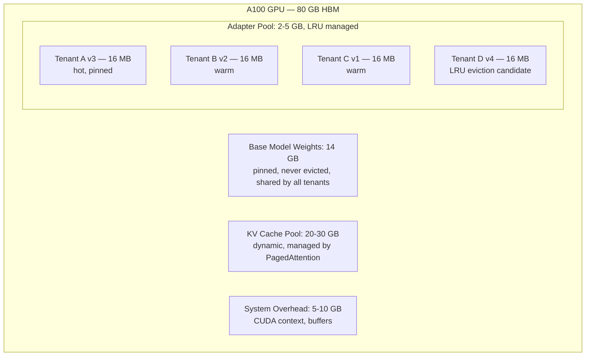
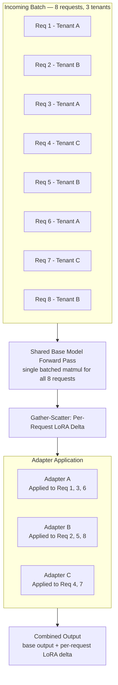
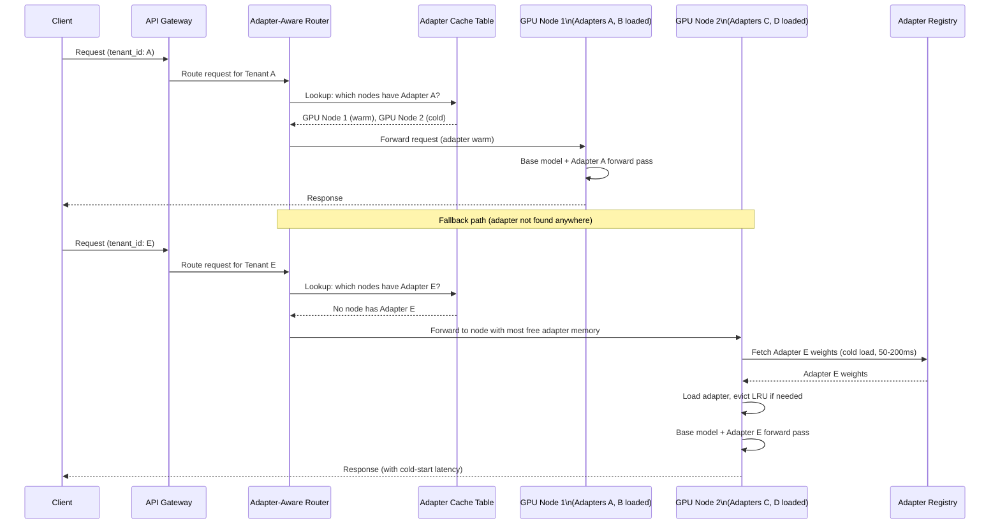

*This post applies the 9-step case study structure from the [GenAI System Design Framework](/blog/genai-system-design-framework). For background on post-training mechanics (SFT, RLHF, DPO), see [Post-Training a Foundation Model for Reasoning](/blog/post-training-reasoning-model).*

## Problem Statement

A B2B SaaS company provides AI-powered customer support automation. Each enterprise customer (tenant) has domain-specific language, product catalogs, escalation policies, and tone preferences. A single general-purpose model handles roughly 70% of tenants well enough. The remaining 30%, often the largest and highest-paying accounts, need customized model behavior: industry jargon that the base model stumbles on, specific escalation thresholds, compliance-mandated phrasing, and consistent output formatting that prompt engineering alone cannot reliably enforce.

The core constraint is economic. Each tenant needs model behavior that feels custom, but the platform cannot afford to deploy a separate full model per tenant. At 50+ tenants with a 7B-parameter base model in FP16, that would mean 50 copies of 14 GB each, 700 GB just for weight storage, before accounting for KV cache, optimizer states, or any redundancy. The architecture must share the expensive parts (base model weights) while isolating the cheap parts (per-tenant behavioral adaptations).

**Primary users**: Tenant platform teams who configure and manage their fine-tuned models through a self-service portal.

**Secondary users**: The internal ML platform team operating the training and serving infrastructure, and tenant end-users who interact with the customized support agents.

### What this system is not

It is not a prompt engineering platform. Per-tenant system prompts can adjust tone and inject context, but they cannot teach the model new behavioral patterns, domain-specific terminology handling, or consistent output formatting that goes beyond what the base model already supports. Prompting has a ceiling, and the tenants who need customization have already hit it.

It is not a full fine-tuning platform. Full fine-tuning creates a separate copy of all model parameters per tenant. At 7B parameters in FP16, that is 14 GB per tenant. For 50 tenants, that is 700 GB in weight storage alone, plus 50 independent GPU deployments for serving. The economics do not work for a multi-tenant SaaS product.

It is not a RAG system. RAG solves knowledge retrieval: facts that change, documents that get updated, product catalogs that expand. This system solves behavioral adaptation: how the model responds, not what facts it retrieves. The two are complementary. Most tenants will use both. This post covers the behavioral adaptation layer.

## Step 0: Why LoRA?

Before discussing infrastructure, it helps to be explicit about why parameter-efficient fine-tuning is the right tool here, and what it actually does at the weight level.

### Why fine-tuning at all

Prompting has a practical ceiling for behavioral customization. A legal tech tenant needs the model to always cite clause numbers in a specific format, never use hedging language in recommendations, and structure every response as a three-part analysis (issue, applicable clause, recommended action). Prompt engineering gets this format right about 80% of the time. The other 20% produces responses that look different enough to erode trust with end-users. Fine-tuning on 5,000 curated examples of the desired format pushes compliance above 97%.

The pattern holds across tenants. When the behavioral change is structural (output shape, tone, terminology, decision logic) rather than factual (what product costs what, which policy applies), fine-tuning is the right tool. RAG handles the facts. Fine-tuning handles the behavior.

### What LoRA does at the weight level

Low-Rank Adaptation (LoRA) [[1]](#ref-1) freezes the base model's weight matrices and inserts small trainable matrices alongside each target layer (typically the attention layers). For each target weight matrix W of shape (d x d), LoRA adds two matrices: A of shape (d x r) and B of shape (r x d), where r (the rank) is much smaller than d. During inference, the output of that layer becomes Wx + BAx. The key property: only A and B are trained. The original W never changes.

This means the base model stays identical across all tenants. Each tenant's customization lives entirely in their A and B matrices, which contain 0.1-1% of the total parameters. A rank-16 adapter for a 7B model is roughly 16 MB. A rank-64 adapter is around 67 MB. Compare that to 14 GB for a full model copy.

| | Full Fine-Tuning | LoRA (rank 16) | LoRA (rank 64) |
|---|---|---|---|
| Trainable parameters (7B base) | 7B (100%) | ~8M (0.1%) | ~33M (0.5%) |
| Adapter storage per tenant | 14 GB (full copy) | ~16 MB | ~67 MB |
| Storage for 50 tenants | 700 GB | 800 MB | 3.3 GB |
| Training GPU memory | 80+ GB (full model gradients) | 18-24 GB (frozen base + adapter gradients + optimizer) | 24-32 GB |
| Training time (10K examples) | 4-8 hours on 4x A100 | 30-60 min on 1x A100 | 1-2 hours on 1x A100 |
| Quality vs full fine-tuning | Baseline | 90-95% | 95-99% |

### Cost math for the scenario

Full fine-tuning 50 tenants: roughly $2,500-5,000/month in training compute, 700 GB storage, and the operational burden of managing 50 separate model deployments for serving. Serving alone would need 50 independent GPU allocations.

LoRA for 50 tenants: roughly $200-400/month in training compute, under 5 GB total adapter storage, and a single shared base model deployment with swappable adapters. The marginal cost per additional tenant is the cost of training one adapter (a few dollars) plus the memory for one 16-67 MB weight file.

The systems analogy that helps here: LoRA adapters are to a base model what dynamically-loaded shared libraries are to an operating system kernel. The kernel (base model) is loaded once in memory and shared across all processes (tenants). Each shared library (adapter) modifies specific behaviors without forking the entire kernel. You do not copy the kernel to change one syscall.

### When LoRA is not enough

LoRA cannot fix a fundamentally mismatched base model. If the domain vocabulary is so specialized that the tokenizer fragments important terms into many subword tokens, causing the model to waste capacity on basic comprehension, you need a domain-specific base model with a custom tokenizer (the approach covered in the [healthcare foundation model case study](/blog/healthcare-foundation-model)). LoRA also cannot inject knowledge the base model never learned during pre-training. It reshapes existing capabilities; it does not create new ones from scratch.

## Step 1: Requirements

### Functional requirements

- Tenants upload training data (instruction-response pairs, behavioral examples) through a self-service API
- The system trains a LoRA adapter per tenant on the shared base model
- Trained adapters pass through automated quality gates before promotion to production
- The serving layer routes each request to the correct tenant's adapter
- Support A/B testing between adapter versions per tenant
- Adapter versioning with one-click rollback to the previous production version
- Fallback to the base model (no adapter) if a tenant's adapter fails to load or produces errors

### Non-functional requirements

- **Training latency**: Adapter ready for validation within 2 hours of data submission
- **Serving latency**: Time-to-first-token under 500ms at P95, regardless of whether the adapter is warm or cold-loaded
- **Tenant isolation**: One tenant's training or serving load must not degrade another tenant's performance
- **Availability**: 99.9% for serving; 99% for training (training jobs can be retried)
- **Cost**: Under $100/month per tenant for training; inference cost overhead from LoRA serving under 10% compared to base model alone

### Scale assumptions

| Parameter | Value | Rationale |
|---|---|---|
| Base model | 7B parameters, FP16 | Large enough for nuanced behavioral adaptation, small enough for single-GPU serving with adapters |
| Tenants | 50 current, 200 target over 18 months | Growth driven by enterprise sales pipeline |
| Active adapters in serving | 50 concurrently loaded, 200 registered | Not all tenants generate traffic simultaneously |
| Requests per second (total) | 500-1,000 QPS across all tenants | Uneven distribution: top 10 tenants generate 60% of traffic |
| Training jobs per day | 5-15 | Mix of new tenant onboarding and periodic retraining |
| Training data per tenant | 1K-50K conversation examples | Wide variance by tenant maturity |
| Adapter size (rank 16) | ~16 MB | Fits in GPU memory alongside dozens of other adapters |

### Quality metrics

| Metric | Target | How it is measured |
|---|---|---|
| Task-specific eval (per tenant) | Over 5% improvement over base model on tenant's eval set | Automated evaluation before promotion |
| Regression on general capability | Under 2% degradation on shared benchmark suite | Prevents adapter overfitting that breaks general ability |
| Output format compliance | Over 95% on tenant-specific output schema tests | Structured output validation |
| A/B test significance | 95% confidence before full promotion | Statistical significance on live traffic split |

### Trade-offs to acknowledge

| Dimension | Option A | Option B | Our choice |
|---|---|---|---|
| Rank vs memory | Higher rank (64): better quality, 67 MB per adapter, fewer concurrent adapters per GPU | Lower rank (16): slightly lower quality, 16 MB per adapter, 4x more concurrent adapters | Start with rank 16 for most tenants, offer rank 64 for enterprise tier with quality-sensitive workloads |
| Training freshness | Daily retraining captures behavioral drift quickly | Weekly retraining is 5-7x cheaper | Weekly default, with tenant-configurable override for daily |
| Cold start strategy | Preload all adapters: zero cold starts, wastes memory on inactive tenants | Load on demand: efficient memory, 50-200ms cold start penalty | Preload top 10 by traffic (hot), LRU cache for the rest |

## Step 2: Architecture Overview

The platform separates into two planes with the adapter registry as the contract between them.

**Training Plane** (left side): Handles data ingestion, validation, adapter training, and quality evaluation. Runs on a separate GPU pool from serving because training and inference have different utilization patterns, SLA requirements, and scaling characteristics. Training GPUs run at high utilization in bursts; serving GPUs need consistent low-latency availability.

**Serving Plane** (right side): Handles request routing, adapter loading, inference, and response delivery. The base model is loaded once per GPU node. Adapters are loaded into a shared memory pool and applied per-request.

**Adapter Registry** (center): The bridge between training and serving. Training writes adapter artifacts here. Serving reads them. Neither plane knows the other's internals. This is the same decoupling pattern as a container registry between CI/CD and deployment: the registry stores versioned, immutable artifacts with metadata, and consumers pull what they need.

### Training-to-serving lifecycle

The adapter lifecycle flows through five stages:

1. **Tenant uploads data** through the self-service API. The data pipeline validates schema, checks minimum size thresholds, scrubs PII, and stores the dataset in tenant-isolated storage.
2. **Training scheduler** picks up the job from the queue (priority based on tenant tier), allocates a GPU from the training pool, and launches the training run. The base model is loaded in inference mode (frozen); only the adapter parameters receive gradients.
3. **Trained adapter** is pushed to the registry with status `candidate`. The evaluation service pulls it and runs the quality gate suite.
4. **If all gates pass**, the adapter is promoted to `validated`. If any gate fails, it moves to `rejected` with a diagnostic report sent to the tenant.
5. **Serving plane** detects the new validated adapter on its next registry poll (or via webhook). It pulls the weights and loads them into GPU memory. Traffic shifts from the old version to the new version according to the tenant's rollout configuration (immediate swap or gradual A/B ramp).

## Step 3: Training Pipeline

The training pipeline is, at its core, a CI/CD system for model behavior.

### Data pipeline for per-tenant training data

Each tenant's training data flows through a standardized pipeline before it reaches a GPU:

**Validation**: Schema checks (instruction-response pair format), minimum dataset size (at least 500 examples for rank 16, 2,000 for rank 64), maximum size caps (to prevent runaway training costs), and encoding checks.

**PII detection and scrubbing**: Tenant data often contains customer interactions. Before training, the pipeline runs named entity recognition to flag and redact personal identifiers. This is both a compliance requirement and a model safety measure: you do not want adapters that have memorized customer phone numbers.

**Deduplication**: Near-duplicate examples inflate training time without improving adapter quality. The pipeline computes semantic similarity hashes and removes examples above a similarity threshold.

**Data isolation**: Each tenant's data is stored in an isolated storage prefix with access controls. Training jobs receive short-lived credentials scoped to their tenant's data. A training job for Tenant A cannot read Tenant B's data, even if both jobs run on the same GPU node.

**Data versioning**: Each training run records the exact dataset snapshot (hash and version) used. This enables reproducibility: given the same data version and hyperparameters, the pipeline produces a comparable adapter. It also enables auditing: if an adapter produces unexpected behavior, you can trace exactly which data it trained on.

### How PEFT training differs from full fine-tuning (for infrastructure engineers)

This distinction matters because it changes the compute requirements by an order of magnitude.

In full fine-tuning, every parameter in the model receives gradient updates during backpropagation. For a 7B model in FP16, that means storing the model weights (14 GB), gradients (14 GB), and optimizer states (28 GB for Adam, which keeps running mean and variance per parameter). Total: roughly 56 GB just for the training state, before accounting for activations and batch data. This exceeds a single A100's 80 GB, so you need model parallelism across multiple GPUs, with gradient synchronization between them.

In LoRA training, the base model is frozen. Its weights are loaded in inference mode (14 GB), but no gradients are computed for them. Only the adapter parameters (8-33 million, depending on rank) receive gradients. Optimizer states scale with adapter size, not model size. The result: a rank-16 adapter for a 7B model trains comfortably on a single A100 with room to spare.

The infrastructure implication is significant. You do not need a distributed training cluster per tenant. A single GPU handles one adapter training job. This changes the scheduling problem from "allocate and coordinate a multi-GPU cluster per job" to "allocate a single GPU per job from a shared pool." It is a bin-packing problem, not a distributed systems coordination problem.

### Compute allocation and scheduling

With 5-15 training jobs per day, each needing one GPU for 30-120 minutes, the scheduling challenge is modest but still worth getting right.

**Priority queues**: Tenant tier determines scheduling priority. Enterprise tenants (higher revenue, stricter SLAs) get priority over standard-tier tenants. Within the same tier, first-in-first-out.

**Preemption with checkpoint resume**: Lower-priority jobs can be preempted when a higher-priority job arrives and no GPUs are free. LoRA training checkpoints frequently (every 100-200 steps takes seconds), so a preempted job resumes from the last checkpoint with minimal wasted compute. The worst case is re-running 100-200 gradient steps, roughly 1-3 minutes of work.

**GPU pool sizing**: 15 jobs per day averaging 1 hour each means roughly 15 GPU-hours of daily demand. A pool of 3-4 GPUs handles this with acceptable queue times during burst periods (multiple tenants submitting data around the same time). The pool scales based on queue depth: if the queue consistently exceeds 5 pending jobs, add a GPU. If utilization drops below 30% for a sustained period, release one.

The analogy that captures this: the training pipeline is CI/CD for model behavior. Data upload is the commit. Training is the build. Evaluation is the test suite. Promotion is the deployment. The GPU pool is the build runner fleet. Preemption with checkpoint resume is the equivalent of canceling a low-priority build to run a hotfix build, then resuming the low-priority build from its last cached state.

### Quality gates before adapter promotion

Every adapter must pass five automated gates before it reaches production. No exceptions, no manual overrides in the default path.

| Gate | What it checks | Failure action |
|---|---|---|
| Training convergence | Loss decreased by over 20% from initialization | Reject: insufficient data quality or quantity, or bad hyperparameters |
| Task-specific evaluation | Score exceeds tenant's baseline threshold on their eval set | Reject: adapter did not learn the target behavior |
| Regression check | General benchmark score within 2% of base model alone | Reject: adapter overfit to tenant data and broke general capability |
| Safety screening | No increase in harmful, toxic, or non-compliant outputs vs base model | Reject: training data introduced unsafe patterns |
| Format compliance | Output structure matches tenant's required schema on over 95% of test inputs | Reject: adapter does not follow the required response format |

Adapters that pass all gates move to `validated` status. Adapters that fail any gate move to `rejected` with a detailed diagnostic report: which gate failed, by how much, and representative failure examples. The tenant can then fix their training data and resubmit.

Adapters in the registry are immutable once written. A "fix" is always a new training run producing a new version, never a mutation of the existing artifact. This keeps the audit trail clean and makes rollback straightforward: point to the previous version.

## Step 4: Multi-Tenant LoRA Serving

This is where the distributed systems challenges concentrate. The training pipeline is a relatively standard batch processing system. The serving layer is where memory management, batching, and latency guarantees get interesting.

### GPU memory management: shared base model, swappable adapters

A single A100 (80 GB HBM) hosts the following in memory:

- **Base model weights**: 14 GB (7B parameters in FP16). Loaded once, pinned, never evicted. Shared across all requests regardless of tenant.
- **KV cache pool**: 20-30 GB. Managed by the inference engine (vLLM's PagedAttention [[8]](#ref-8) or equivalent). Scales with concurrent request count and sequence length.
- **Adapter memory pool**: 2-5 GB. Holds the currently loaded LoRA adapters. At 16 MB per rank-16 adapter, this pool fits 125-300 adapters simultaneously.
- **System overhead**: 5-10 GB for CUDA context, inference engine state, and buffers.

The adapter pool is the interesting part. It operates like a page cache in an operating system. The base model is the kernel, always resident. Adapters are cached pages. Frequently accessed adapters stay resident. Rarely accessed adapters get evicted when memory pressure rises, and reloaded when needed.

### Adapter loading tiers

**Hot adapters**: The top 10 tenants by traffic volume. These adapters are pinned in GPU memory and never evicted. They account for 60% of total request volume, so keeping them warm eliminates cold starts for the majority of traffic. Memory cost: 10 x 16 MB = 160 MB. Negligible.

**Warm adapters**: Loaded in GPU memory, subject to LRU eviction when the adapter pool fills up. These are tenants with moderate but irregular traffic. An adapter stays warm as long as it has received a request recently enough to avoid being the least-recently-used entry.

**Cold adapters**: Not currently in GPU memory. When a request arrives for a cold adapter, the serving node fetches the weights from the local NVMe cache (sub-millisecond if cached there) or from the adapter registry over the network (10-50ms for a 16 MB file on a fast internal network). Then it copies the weights to GPU memory (1-5ms). Total cold start overhead: 50-200ms depending on where the weights are and network conditions.

### Quantization and adapter compatibility

A natural serving optimization is to quantize the base model to INT8 or FP8, halving its memory footprint from 14 GB to 7 GB and freeing headroom for more adapters or a larger KV cache. But quantization interacts with adapter serving in a specific way that matters for system design.

LoRA adapters are trained against the full-precision base model. Their A and B matrices encode deltas in FP16. If you quantize the base model weights to INT8, the adapter delta is applied to a quantized activation stream, not the FP16 activation stream the adapter was trained against. The mismatch degrades adapter quality, sometimes significantly.

There are two ways to handle this in production:

**Dequantize-apply-requantize**: At each layer where an adapter is applied, dequantize the base model output to FP16, add the LoRA delta in FP16, then requantize before passing to the next layer. This preserves adapter quality at the cost of per-layer quantization overhead. TensorRT-LLM [[13]](#ref-13) and vLLM implement this pattern for INT8 base models with FP16 adapters.

**Quantization-aware adapter training**: Train adapters against the quantized base model from the start. This produces adapters that work correctly with quantized activations. The infrastructure requirement is that the training pipeline must use the same quantized base model that serving uses. Any time the serving quantization scheme changes (INT8 to FP8, different quantization granularity), adapters need to be retrained. For a platform serving 50+ tenants, this retraining obligation is worth flagging explicitly in your runbooks.

For this platform at 50 tenants and a 7B base model, starting with FP16 serving is defensible. The 7B model fits in 14 GB, well within a single A100. Quantization becomes worth the complexity when you either run out of GPU memory (scaling to larger base models, or serving a much larger adapter pool) or need to reduce inference cost per token on the serving side. Design the adapter training pipeline to support the quantized path from the beginning, even if you do not activate it immediately.

### Eviction policy

The default policy is LRU with pinning and minimum residency:

- **Pinned adapters** (hot tier) are exempt from eviction.
- **Minimum residency**: An adapter cannot be evicted within 30 seconds of being loaded. This prevents thrashing when a burst of requests for different tenants causes rapid load-evict-load cycles.
- **Eviction trigger**: When a request arrives for a tenant whose adapter is not loaded, and the adapter pool is full, evict the least-recently-used non-pinned adapter that has exceeded its minimum residency time.
- **Prefetching**: If traffic patterns are predictable (Tenant A is active during US business hours, Tenant B during EU hours), pre-warm adapters before the traffic arrives. This is analogous to page prefetching based on access patterns in virtual memory systems.

### KV cache isolation across tenants

The KV cache pool is shared across all tenants on the same GPU node. This is necessary for memory efficiency but creates a cross-tenant interference risk: a tenant submitting very long sequences (large input documents, long conversation histories) consumes more KV cache pages and can reduce the effective concurrency available to other tenants.

vLLM's PagedAttention [[8]](#ref-8) allocates KV cache in fixed-size pages, which avoids the fragmentation problem but does not enforce per-tenant quotas by default. For a multi-tenant SaaS platform, you need explicit controls:

- **Per-tenant max sequence length**: Hard cap on input + output token length per request. A tenant processing long documents may need 8K or 16K context; a conversational support agent rarely needs more than 2K. Enforcing the right cap per tenant prevents one tenant's long-context workload from evicting KV pages for many others.
- **Per-tenant KV budget**: Allocate a maximum fraction of the KV pool per tenant during high-load periods. This is equivalent to CPU quotas in a container scheduler. A tenant hitting their KV budget gets their requests queued rather than silently degrading other tenants.
- **Preemption with recomputation**: If a long-running request holds KV pages that are blocking higher-priority requests, vLLM can preempt it (write KV state to CPU memory, free GPU pages) and resume it later. This is useful for handling the occasional runaway long-sequence request without permanent resource starvation.

At 500-1,000 QPS across 50 tenants, KV cache contention is rarely the primary bottleneck. It becomes relevant when tenant usage patterns are asymmetric (a few tenants doing long-context analysis next to many doing short conversational turns) or when you add larger context windows to support enterprise use cases.

### Heterogeneous batching

This is the critical serving optimization. Without it, multi-tenant LoRA serving is economically impractical at scale.

**The problem**: In standard LLM serving, all requests in a batch use the same model weights. The batch shares a single matrix multiplication per layer. With per-tenant adapters, requests in the same batch may need different adapters applied. If you batch only requests that share the same adapter, you fragment your batch by tenant. A tenant with 5 QPS gets batches of 5 instead of 50. GPU utilization collapses.

**Naive per-adapter batching**: Group requests by tenant, batch within each group. Simple to implement, but GPU utilization drops to 20-40% because batches are small and fragmented. Latency stays low for high-traffic tenants but degrades badly for low-traffic ones (they wait longer to accumulate a batch, or run with batch size 1).

**S-LoRA approach** [[2]](#ref-2): The key insight is that the base model forward pass is identical for all requests, regardless of adapter. The LoRA modification is additive: the output of each layer is base_output + adapter_output. So you run the base model forward pass on the entire batch (all tenants together, full GPU utilization), then apply each request's adapter contribution using a custom CUDA kernel that gathers the correct A and B matrices for each request in the batch and computes the per-request LoRA delta.

**Punica's unified gather kernel** [[3]](#ref-3): Takes the S-LoRA concept further with a single fused CUDA kernel (SGMV, Segmented Gather Matrix-Vector multiplication) that handles the entire adapter computation for a heterogeneous batch in one kernel launch. This avoids the overhead of launching separate kernels per adapter or per request.

| Batching strategy | Effective batch size | GPU utilization | Latency overhead vs base model | Implementation complexity |
|---|---|---|---|---|
| Per-adapter batching | Limited by per-tenant QPS | 20-40% | None | Low |
| S-LoRA heterogeneous batching | Full batch capacity | 80-95% | 5-15% | Medium (custom kernels) |
| Punica unified kernel | Full batch capacity | 85-95% | 5-10% | High (fused CUDA) |

For this platform, S-LoRA-style heterogeneous batching through vLLM's built-in LoRA support [[6]](#ref-6) is the practical starting point. It provides 80-95% of base model throughput with manageable implementation effort. Punica's approach is worth considering if the 5-10% additional overhead from S-LoRA becomes a bottleneck at higher scale.

## Step 5: Routing and Adapter-Aware Load Balancing

Standard load balancers distribute requests by server health, CPU utilization, or round-robin. For LoRA serving, the router must also consider which adapters are loaded on which GPU nodes. This adds a dimension to the routing decision that changes the architecture.

### Adapter-aware routing

The request router maintains a soft-state table mapping each GPU node to its set of currently loaded adapters. GPU nodes report their adapter inventory via periodic heartbeats (every 5-10 seconds). The table is eventually consistent: a node might load or evict an adapter between heartbeats, so the router's view can be slightly stale. This is acceptable because a wrong routing decision (sending a request to a node that just evicted the adapter) results in a cold load, not an error. The penalty is latency, not correctness.

**Routing policy** (evaluated in order):

1. **Prefer adapter-warm nodes**: Route to a GPU node that already has the tenant's adapter loaded. This avoids cold start entirely.
2. **Among warm nodes, prefer lowest queue depth**: If multiple nodes have the adapter, pick the one with the shortest request queue. Standard load-balancing within the warm set.
3. **If no warm node exists, prefer the node with the most free adapter memory**: This minimizes the chance that loading the new adapter triggers an eviction of another active adapter. The node with the most headroom absorbs the new adapter with the least disruption.
4. **If all nodes are at capacity, route to the node whose LRU candidate is the coldest**: If eviction is unavoidable, evict the adapter that has been idle the longest.

The systems analogy: this is session affinity (sticky routing) at the GPU level. Tenant A's requests prefer GPU nodes where Tenant A's adapter is resident, similar to how sticky sessions in web services route users to the server holding their session state. The difference is that "session state" here is a 16 MB weight matrix in GPU memory, and the cost of a cache miss is 50-200ms of cold load latency rather than a full session rebuild.

### A/B testing adapters in production

The router supports traffic splitting between adapter versions per tenant. A tenant can configure: 90% of traffic to adapter v3, 10% to adapter v4. The router applies this split at the request level, not the node level. Both versions must be loadable (ideally both warm on at least one node), and the router treats version as part of the routing key.

Metrics collected per version: latency distribution, task completion rate (does the end-user accept the response or retry?), format compliance rate, and any tenant-specific quality signals. When v4 meets or exceeds v3's metrics with 95% statistical confidence, the tenant (or an automated promotion rule) shifts traffic to 100% v4. The old version moves to `deprecated` status and is eventually evicted from serving nodes.

### Fallback to base model on adapter failures

If an adapter fails to load (corrupted weights, out-of-memory on the target node), the request falls back to the base model with no adapter applied. This is strictly better than failing the request entirely. The base model produces reasonable (if not tenant-customized) output. The response includes a header indicating that fallback was used, so the tenant's monitoring can track it.

**Circuit breaker pattern**: If an adapter causes repeated inference errors (CUDA faults, consistently malformed output, latency exceeding 3x the P99 threshold), the serving node automatically disables it and routes all traffic for that tenant to the base model. An alert fires to the platform team. The adapter remains disabled until someone investigates and either fixes the issue (by training a new version) or confirms it is safe to re-enable.

**Fallback rate monitoring**: If a tenant's fallback rate exceeds 5% over a 15-minute window, the platform fires an alert. Sustained fallback means the tenant is not getting the customization they are paying for.

## Step 6: Adapter Registry and Versioning

The adapter registry is the central artifact store bridging training and serving. Its design follows the same principles as a container registry (ECR, GCR) or a package registry (npm, PyPI): versioned, immutable artifacts with metadata, accessible by both producers and consumers through a standard API.

### What is stored per adapter version

- **Weights file**: The A and B matrices in safetensors format. Typically 16-67 MB depending on rank.
- **Training configuration**: Rank, target modules (which attention layers received adapters), learning rate, batch size, number of epochs, base model version. Enables reproduction.
- **Training data hash**: SHA-256 of the dataset snapshot. Enables tracing from adapter behavior back to training data.
- **Evaluation results**: Scores from each quality gate, with representative examples of successes and failures.
- **Promotion status**: One of `candidate`, `validated`, `rejected`, `deployed`, `active`, `deprecated`.
- **Creation timestamp and lineage**: When the adapter was created, which training job produced it, and which previous adapter version (if any) it replaces.

### Immutability and versioning

Once an adapter version is written to the registry, it is never modified. Updates always produce new versions. This keeps the audit trail clean: you can always answer "what was Tenant A running on March 15th?" by looking at the version pointer history.

Each tenant has two pointers: `current` (the active production adapter) and `previous` (the last production adapter before the current one). Rollback is a pointer swap: move `current` to point at `previous`. The serving layer picks up the change within one heartbeat cycle (5-10 seconds). No retraining, no redeployment.

**Naming convention**: `{tenant_id}/{adapter_name}:{version}` (e.g., `acme-corp/support-agent:v4`). Familiar to anyone who has worked with container image tags.

### Storage tiers

| Tier | What lives here | Access latency | Cost |
|---|---|---|---|
| Hot (NVMe cache on GPU nodes) | `current` and `previous` versions for tenants routed to this node | Sub-millisecond | Highest (local SSD) |
| Warm (S3/GCS) | Last 5 versions per tenant | 10-50ms (network fetch) | Low |
| Cold (S3 Glacier or equivalent) | All older versions, kept for audit and compliance | Minutes | Minimal |

The total storage footprint is small. 200 tenants x 5 versions x 67 MB (worst case, rank 64) = 67 GB in warm storage. This is a rounding error in cloud storage costs.

## Failure Modes

### Adapter poisoning via bad training data

A tenant uploads training data containing adversarial examples or subtly biased content. The adapter learns to produce harmful or non-compliant outputs. The quality gates (regression check, safety screening) catch most cases, but adversarial examples specifically crafted to pass automated checks while being harmful in production are difficult to detect fully.

**Mitigation**: Post-deployment monitoring of flagged outputs per adapter. If the rate of outputs flagged by the runtime safety classifier spikes for a specific adapter (compared to its baseline), automatic rollback to the previous adapter version. The flagged outputs are logged for review by the trust and safety team.

### Cascade eviction under load spikes (thrashing)

A sudden burst of requests from 20 different tenants hits a GPU node that has adapters loaded for only 10 of them. The node rapidly evicts and loads adapters, spending more time on memory operations than on inference. This is the thrashing problem from operating systems virtual memory management.

**Mitigation**: The minimum residency time (30 seconds) prevents the fastest eviction cycles. A rate limit on evictions (no more than 5 evictions per minute per node) caps the overhead. If eviction demand exceeds the cap, excess requests fall back to the base model rather than triggering more evictions. The monitoring system alerts on sustained high eviction rates so the team can add GPU capacity or adjust the hot-adapter pinning list.

### Adapter version skew during rollout

The router directs traffic for Tenant A to two GPU nodes. Node 1 has loaded adapter v4 (the new version). Node 2 still has v3 (it has not polled the registry since the promotion). Different requests from the same tenant get different model behaviors, which can confuse end-users in multi-turn conversations.

**Mitigation**: During A/B testing, version skew is intentional and the router controls the split. During a non-A/B promotion (immediate swap), the router treats adapter version as part of the routing key. Once the `current` pointer moves to v4, the router only routes to nodes that have v4 loaded, even if that means temporary load imbalance. Nodes still running v3 receive a priority signal to load v4 on their next heartbeat.

### Registry unavailability

If the adapter registry goes down, the serving plane continues operating with currently loaded adapters. No new adapters can be deployed, and no rollbacks can execute (since rollback changes the pointer in the registry). Training outputs queue until the registry recovers.

**Mitigation**: GPU nodes cache the last-known-good adapter weights on local NVMe. The registry is the source of truth, but the serving plane survives without it for short outages. The registry itself runs with standard high-availability patterns (replicated metadata store, object storage backend with cross-region replication). Target recovery time: under 15 minutes.

## Operational Concerns

### Monitoring

| Metric | What it tells you | Alert threshold |
|---|---|---|
| Adapter cache hit rate (per GPU node) | Routing efficiency and adapter locality | Below 80% sustained over 10 minutes |
| Cold start latency P99 | Worst-case user-facing latency from adapter loading | Above 500ms |
| Adapter eviction rate (per node) | Memory pressure and potential thrashing | Above 10 evictions/minute sustained |
| Fallback rate (per tenant) | Adapter health or capacity issues | Above 5% over 15 minutes |
| Training queue depth | Training capacity pressure | Above 10 pending jobs |
| Quality gate pass rate | Tenant data quality signal | Below 70% (tenants are submitting bad data) |
| Adapter version age (per tenant) | Behavioral staleness | Above 30 days without retraining |

### Cost breakdown

| Component | Monthly cost (50 tenants) | Notes |
|---|---|---|
| Training compute (GPU pool) | $200-400 | 3-4 A100s, shared, burst utilization |
| Serving compute (base model) | $8,000-15,000 | 4-8 A100s for 500-1,000 QPS. This cost exists regardless of LoRA. |
| LoRA serving overhead | $800-1,500 | ~10% overhead on serving compute from adapter application |
| Adapter storage (all tiers) | Under $50 | 50 tenants x 5 versions x 67 MB = 16 GB |
| Registry and metadata | Under $100 | Replicated metadata store + object storage |
| **LoRA-specific marginal cost** | **~$1,000-2,000** | **On top of base model serving cost** |

The key takeaway: the marginal cost of multi-tenant LoRA is roughly 10-15% on top of the base model serving cost. The alternative (50 separate full model deployments) would multiply the serving cost by 50x.

### Rollout strategy

**Phase 1 (weeks 1-4)**: Deploy base model serving with adapter loading capability. Onboard 3 pilot tenants with manually triggered adapter training. Validate the full lifecycle end-to-end.

**Phase 2 (weeks 5-8)**: Self-service training pipeline with automated quality gates. Onboard 10 additional tenants. Implement LRU eviction and cold-start handling.

**Phase 3 (weeks 9-16)**: Heterogeneous batching via vLLM LoRA support. Adapter-aware routing. A/B testing infrastructure. Scale to 50 tenants.

**Phase 4 (months 5+)**: Autoscaling based on per-tenant traffic patterns. Predictive adapter prewarming using historical traffic data. Scale toward 200 tenants. Evaluate Punica-style fused kernels if the S-LoRA overhead becomes a bottleneck.

## Going Deeper

**QLoRA and memory-efficient training**: Training adapters in 4-bit quantized mode (QLoRA [[4]](#ref-4)) reduces training GPU memory by another 2-3x, enabling adapter training on smaller GPU instances or even consumer hardware. The trade-off is slightly lower adapter quality and added complexity in quantization-aware training. For a platform operating at 50+ tenants, the compute savings from QLoRA can reduce the training GPU pool from 3-4 A100s to 2 A10G instances, a meaningful cost reduction.

**Multi-adapter composition (adapter stacking)**: Some tenants might benefit from composing multiple adapters: a domain adapter (legal language patterns) stacked with a task adapter (summarization format). LoRA adapters can be merged or applied sequentially, but interaction effects between adapters are poorly understood and can produce unexpected behavior. This is an active research area with practical implications for platforms serving tenants with overlapping customization needs.

**Adapter merging for popular patterns**: If 20 tenants independently train adapters that converge to similar weight directions (they all want the model to be more concise), you can merge those adapters into a shared "conciseness" adapter applied as a default. Model soups [[9]](#ref-9) and adapter averaging techniques apply here. This reduces the number of unique adapters in the system and improves GPU memory utilization.

**Federated adapter training**: Tenants unwilling to share training data but who would benefit from each other's behavioral patterns represent a natural fit for federated learning. Federated LoRA training aggregates adapter gradients across tenants without centralizing raw data. The infrastructure requirements (secure aggregation servers, differential privacy on adapter gradients, communication rounds) add substantial engineering effort but unlock cross-tenant learning in privacy-sensitive verticals like healthcare and financial services.

**Dynamic rank allocation**: Not all tenants need the same adapter rank. A tenant with 50K training examples benefits from rank 64. A tenant with 1K examples might overfit at rank 64 and perform better at rank 8. Automatically selecting rank based on dataset characteristics (size, diversity, task complexity) saves GPU memory at serving time and improves quality for small-data tenants. This is a hyperparameter search problem that the training pipeline can solve automatically with a small validation-based rank sweep before the full training run.

**Continuous adapter updates from production signals**: Instead of batch retraining on explicit data uploads, continuously update adapters using reinforcement learning from production feedback signals (user acceptance rates, retry patterns, escalation frequency). This keeps adapters fresh without requiring tenants to curate and upload new training data. The infrastructure for online adapter updates is operationally harder than batch training (you need streaming data pipelines, stable online RL, and careful guardrails against feedback loops), but it is the natural endpoint for a mature multi-tenant adaptation platform.

## References

1. [Hu et al. - LoRA: Low-Rank Adaptation of Large Language Models (2021)](https://arxiv.org/abs/2106.09685) - The foundational paper introducing LoRA
2. [Sheng et al. - S-LoRA: Serving Thousands of Concurrent LoRA Adapters (2023)](https://arxiv.org/abs/2311.03285) - Heterogeneous batching and memory management for multi-adapter serving
3. [Chen et al. - Punica: Multi-Tenant LoRA Serving (2023)](https://arxiv.org/abs/2310.18547) - Unified SGMV kernel for fused multi-adapter computation
4. [Dettmers et al. - QLoRA: Efficient Finetuning of Quantized LLMs (2023)](https://arxiv.org/abs/2305.14314) - 4-bit quantized LoRA training
5. [HuggingFace PEFT Library](https://huggingface.co/docs/peft) - The standard library for parameter-efficient fine-tuning
6. [vLLM LoRA Support](https://docs.vllm.ai/en/latest/features/lora.html) - Production-grade LoRA serving with heterogeneous batching
7. [LoRAX by Predibase](https://github.com/predibase/lorax) - Multi-LoRA inference server optimized for multi-tenant serving
8. [Kwon et al. - Efficient Memory Management for LLM Serving with PagedAttention (2023)](https://arxiv.org/abs/2309.06180) - Memory management foundation used by vLLM
9. [Wortsman et al. - Model Soups: Averaging Weights of Multiple Fine-tuned Models (2022)](https://arxiv.org/abs/2203.05482) - Weight averaging techniques applicable to adapter merging
10. [Aghajanyan et al. - Intrinsic Dimensionality Explains the Effectiveness of Language Model Fine-Tuning (2020)](https://arxiv.org/abs/2012.13255) - Theoretical basis for why low-rank adaptation works
11. [Dettmers et al. - LLM.int8(): 8-bit Matrix Multiplication for Transformers (2022)](https://arxiv.org/abs/2208.07339) - Quantization techniques relevant to serving efficiency
12. [Liu et al. - DoRA: Weight-Decomposed Low-Rank Adaptation (2024)](https://arxiv.org/abs/2402.09353) - Improved LoRA variant decomposing magnitude and direction
13. [NVIDIA TensorRT-LLM](https://nvidia.github.io/TensorRT-LLM/) - Production inference engine with LoRA adapter support
14. [Zheng et al. - SGLang: Efficient Execution of Structured Language Model Programs (2023)](https://arxiv.org/abs/2312.07104) - Serving framework with structured generation support
15. [Anyscale - Scalable Fine-Tuning with Ray](https://www.anyscale.com/blog) - Distributed training orchestration patterns
16. [MLflow Model Registry](https://mlflow.org/docs/latest/model-registry.html) - Pattern reference for artifact versioning and lifecycle management
17. [Mangrulkar et al. - PEFT: Parameter-Efficient Fine-Tuning of Billion-Scale Models on Low-Resource Hardware (2022)](https://huggingface.co/blog/peft) - Practical guide to PEFT methods
18. [Hu et al. - LoRA Learns Less and Forgets Less (2024)](https://arxiv.org/abs/2405.09673) - Analysis of LoRA vs full fine-tuning on knowledge retention

---

*Note: This blog represents my technical views and production experience. I use AI-based tools to help with drafting and formatting to keep these posts coming daily.*
