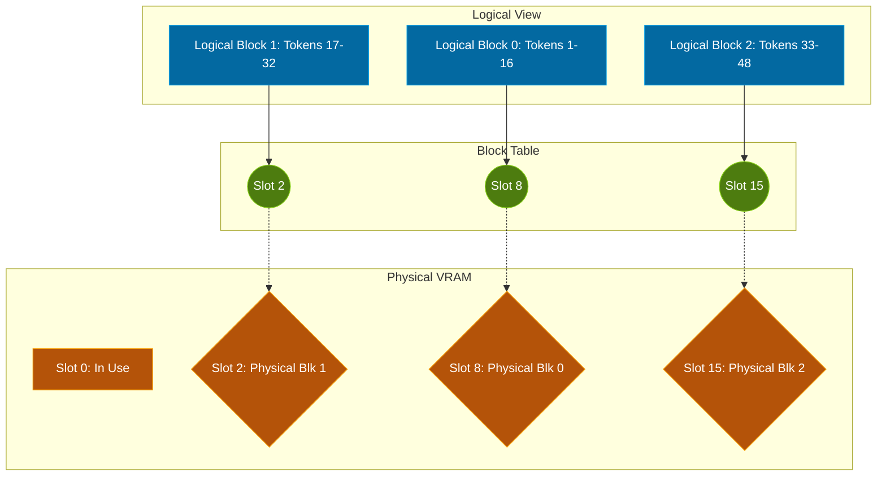

*This post assumes you already understand the KV Cache and why it creates a massive VRAM bottleneck. If you don't fully grasp that memory vs compute trade-off yet, [read my KV cache primer first](/blog/kv-cache).*

> **The 30-Second Version**
> Pre-allocating contiguous memory for the KV Cache wastes up to 80% of GPU memory via internal and external fragmentation. PagedAttention completely solves this by borrowing the concept of virtual memory from operating systems. It chops the KV cache into fixed-size "blocks," dropping them wherever free space is available in physical VRAM. This practically eliminates memory waste and unlocks flexible KV cache sharing between requests.

## The practical scenarios you'll need to master

System design interviews for serving platforms love to drill down into memory management because it is inherently the hardest part of the job. Expect these exact scenarios to come up:

* **The 60% Waste**: You scale up your batch size, but the system crashes with an OOM error while your dashboard shows you theoretically have gigabytes of free VRAM left. You will need to explain **Memory Fragmentation** and why pre-allocation is lethal.
* **The Architecture Challenge**: An interviewer asks you to whiteboard how vLLM manages memory. You must be able to visually connect logical token blocks, the **Block Table**, and physical GPU memory.
* **Parallel Sampling Cost**: A user asks your system to generate 5 slightly different email drafts from the exact same prompt. Doing this naively OOMs the server immediately. You will need to explain how PagedAttention enables **block-level sharing** to save memory.

Before looking at the solution, let us examine the massive inefficiency that forced the industry to invent this in the first place.

---

## The Problem: Why your VRAM is bleeding out

Before PagedAttention, older inference systems struggled because KV cache memory for each request grows and shrinks dynamically. To manage this safely, early implementations (like standard HuggingFace Transformers) simply allocated memory contiguously. 

When a request arrived, the engine had to guess the maximum possible length of the resulting conversation and reserve a massive, unbroken chunk of VRAM right out of the gate. 

This created a severe problem with **internal fragmentation**. If a system pre-allocated memory for 4,000 tokens just to be safe, but a user only sent a 50-word prompt and got back a 100-word answer, the remaining 3,850 slots in memory stayed completely idle. Because those slots were continuously pre-allocated to that specific request, no other request could use them. By some estimates, these early systems wasted roughly 60% to 80% of expensive GPU capacity on empty, reserved memory.

It gets worse. As requests finish and new ones start, you end up with random, jagged holes of free memory scattered across your VRAM. You might have 20GB of total free space. But if it is split into a bunch of tiny 500MB gaps, and a newly allocated request demands 1GB of contiguous space, the system throws an OOM crash. This is **external fragmentation**.

Finally, these older systems completely lacked memory sharing capabilities. If you ran parallel sampling to generate multiple responses from an identical prompt, the engine stored the exact same prompt KV cache in entirely separate, contiguous memory spaces. This redundant duplication severely limits your batch size.

We desperately needed a way to break up the KV cache so it did not demand massive unbroken blocks of memory.

---

## The Solution: Borrowing from the 1960s

The researchers at UC Berkeley who published the original [PagedAttention paper (arXiv:2309.06180)](https://arxiv.org/abs/2309.06180) and built the [vLLM project](https://blog.vllm.ai/2023/06/20/vllm.html) realized this exact issue was a solved problem. Operating systems fixed memory fragmentation decades ago using virtual memory and paging.

Instead of demanding a single massive chunk of physical RAM for a program, the OS breaks the program's memory into small "pages." It then maps these logical pages to physical slots in the hardware. The physical slots never actually need to sit next to each other.

vLLM's core innovation—**PagedAttention**—does the exact same thing for the KV cache. 

It divides the context sequence into fixed-size "blocks." Each block contains the attention Keys and Values for a set number of tokens. When the model generates new tokens, it simply asks for a new physical block to be allocated anywhere in the VRAM on demand. 

A central "Block Table" keeps track of where all the widely scattered physical blocks are located and maps them back to the correct logical sequence.

Here is a conceptual mapping of how those pieces relate to each other:

Because the hardware blocks are exactly the same size and do not need to be contiguous, external fragmentation drops to nearly zero. Because we allocate physical blocks on-demand instead of pre-allocating the maximum sequence length, internal fragmentation drops to an absolute minimum. Overall, vLLM promises near-zero waste in KV cache memory utilization.

But solving waste is only part of the story. The block architecture enables something arguably more powerful.

---

## Block-Level Sharing

Because PagedAttention separates logical mapping from physical storage, you gain flexible sharing of KV cache within and across requests. 

If two separate user requests share the exact same system prompt, or if you are running beam search to explore multiple generation paths for a single user, you do not need to copy the KV cache vectors over and over.

You simply map two entirely different Logical Blocks in the Block Table to point to the exact same Physical Block in VRAM. This block-level sharing avoids redundant duplication and frees up a massive amount of memory to hold even more active sequences, profoundly increasing your throughput capacity.

---

## The execution tax

Nothing is completely free in systems engineering. PagedAttention fundamentally changes the access pattern of your memory. Instead of a fast, straight sequential read of contiguous tensors, your software is now doing scatter-gather reads across the physical VRAM.

In practice, this means the memory controller is working harder. However, PagedAttention works purely due to highly optimized GPU kernels. The overhead of doing these non-contiguous block lookups is so minimal that it can effectively be overlooked. 

Interestingly, while it is called PagedAttention, it operates at a layer fundamentally below the actual core attention computation. PagedAttention acts simply to fetch the KV values incredibly efficiently from fragmented memory; the attention mechanism calculation itself can then utilize optimized kernels like FlashAttention right on top of it.

One common mistake I have actively seen teams make is messing with the block size trying to optimize too deeply. vLLM defaults to 16 tokens per block. Some engineers try to lower this to 4. This sounds great in theory to reduce internal fragmentation further, but fails brutally in practice. A tiny block size explodes the size of the block table and absolutely hammers the GPU with uncoalesced memory reads. Your throughput will tank instantly. 

---

## Context Dependent Decisions

It is important to understand when this stack actually benefits you. Working with PagedAttention is not a magic bullet that makes every deployment better automatically.

Its value is strictly context dependent. If your serving infrastructure only handles 1 concurrent user doing straightforward generation, PagedAttention provides almost zero benefit. In fact, if you misconfigure it, the kernel lookup overhead might make it slightly slower than naive implementations. 

However, if you are running a high-throughput API serving dozens of concurrent users with varying prompt lengths, or explicitly relying on parallel sampling and beam search, PagedAttention is mandatory. 

---

## Next Steps

Now that we have solved memory fragmentation, we naturally start pushing higher loads onto the GPU. Eventually, we run right back into compute scheduling bottlenecks. Next, we will cover **Continuous Batching**, showing how vLLM handles requests dynamically entering and exiting the GPU queue without waiting for traditional batches to finish. Or we can dive into **Prefix Caching** to explicitly track shared prompt prefixes across massive fleets of users.

---
*Note: This blog represents my technical views and production experience. I use AI-based tools to help with drafting and formatting to keep these posts coming daily.*
