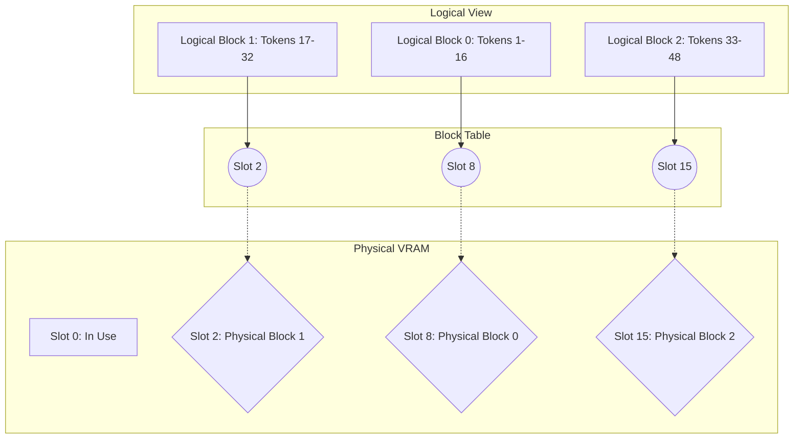

*Assumes you understand the KV Cache VRAM bottleneck. If not, [read my KV cache primer first](/blog/kv-cache).*

> **The 30-Second Version**
> Pre-allocating contiguous memory for the KV Cache wastes up to 80% of GPU memory through fragmentation. PagedAttention borrows the concept of virtual memory from operating systems. It chops the KV cache into fixed-size "blocks," dropping them wherever space is available in physical VRAM, tracked via a block table. This practically eliminates memory waste and unlocks massive batch sizes.

## The practical scenarios you'll need to master

System design interviews for serving platforms love memory management. Expect these exact scenarios:

* **The 60% Waste**: You scale batch size, but the system crashes with OOM despite gigabytes of "free" VRAM. You will need to explain **Memory Fragmentation** and why pre-allocation is lethal.
* **The "How does it work?" Challenge**: Draw how vLLM manages memory. You must connect logical token blocks, the **Block Table**, and physical GPU memory.
* **Parallel Sampling**: Generating 5 slightly different email drafts from the same prompt naively OOMs the server. Explain how PagedAttention enables **Copy-on-Write sharing**.

Let us look at the massive inefficiency that forced the industry to invent this.

---

## Why your VRAM is bleeding out

Before PagedAttention, inference engines (like HuggingFace Transformers) allocated memory for the KV Cache contiguously. 

When a request arrived, the engine guessed the maximum possible conversation length and reserved a massive, unbroken chunk of VRAM. 

I fell into this trap when building my first serving wrapper. I allocated memory for 4000 tokens per request to be safe. What surprised me was how fast I ran out of memory. Most users only sent 50-word prompts and got back 100-word answers. The other 3850 slots stayed empty, but because they were pre-allocated, no other request could use them. 

This is **internal fragmentation**. The system wasted roughly 60% of my expensive A100 capacity.

It gets worse. As requests finish and new ones start, you get random, jagged holes of free memory scattered across VRAM. You might have 20GB of total free space, but if it is split into tiny 500MB gaps, a new request needing 1GB contiguous space triggers an OOM crash. This is **external fragmentation**.

We needed a way to break up the KV cache so it did not demand massive unbroken memory blocks.

---

## Borrowing from the 1960s

The UC Berkeley researchers behind [vLLM](https://blog.vllm.ai/2023/06/20/vllm.html) realized this is a solved problem. Operating systems fixed memory fragmentation decades ago with virtual memory and paging.

Instead of demanding a single massive chunk of physical RAM, the OS breaks a program's memory into small "pages." It maps these logical pages to physical hardware slots. The physical slots never need to sit next to each other.

PagedAttention does the exact same thing for the KV cache. 

It divides the context sequence into fixed-size blocks. Each block holds Keys and Values for a specific number of tokens. When the model generates new tokens, it asks for a new physical block anywhere in VRAM. A central "Block Table" tracks where all the scattered physical blocks live and maps them back to the logical sequence.

Here is the conceptual mapping:

Because hardware blocks do not need to be contiguous, external fragmentation drops to zero. Because we allocate physical blocks on-demand instead of pre-allocating the maximum possible length, internal fragmentation drops under 4%.

You instantly unlock the ability to pack vastly more concurrent requests into the same GPU.

---

## The fragmentation tax

Nothing is completely free. PagedAttention fundamentally changes memory access patterns. Instead of a fast straight read of contiguous tensors, your software does scatter-gather reads across physical VRAM.

The memory controller works harder. The logic required to manage the block table and execute complex attention kernels introduces slight compute overhead. 

Because decode is overwhelmingly memory bandwidth bound rather than compute bound, this is a trade-off every production system happily pays. You trade a sliver of compute latency for a massive leap in batch size throughput.

One common mistake I have actively seen teams make is messing with the block size. vLLM defaults to 16 tokens per block. Some engineers try to lower this to 4 to reduce internal fragmentation further. This sounds great in theory, but fails in practice. A tiny block size explodes the block table size and hammers the GPU with uncoalesced memory reads. Your throughput drops instantly.

---

## Context Dependent Decisions

It is important to understand when this actually benefits you.

PagedAttention value is strictly context dependent. If your serving infrastructure only handles 1 concurrent user, it provides almost zero benefit. The kernel overhead might actually make it slightly slower than naive Transformers. 

However, if you run a high-throughput API serving 200 users with wildly varying prompt lengths, PagedAttention is mandatory. It is the only way to survive the mixture of 50-token chats and 5000-token summaries hitting your server simultaneously.

When monitoring this in production, watch your Block Table Allocation failures. If the system cannot find a free physical block for a generating sequence, it must preempt the request, causing massive latency spikes for the end user.

---

## Next Steps

Now that we solved memory fragmentation for a single model run, how do we handle multiple users asking the exact same question? Next, we will cover **Prefix Caching**, which uses this exact block architecture to share memory across entirely different users. Or we might jump into **Continuous Batching** to see how we feed all these requests to the GPU without stalling.

---
*Note: This blog represents my technical views and production experience. I use AI-based tools to help with drafting and formatting to keep these posts coming daily.*
