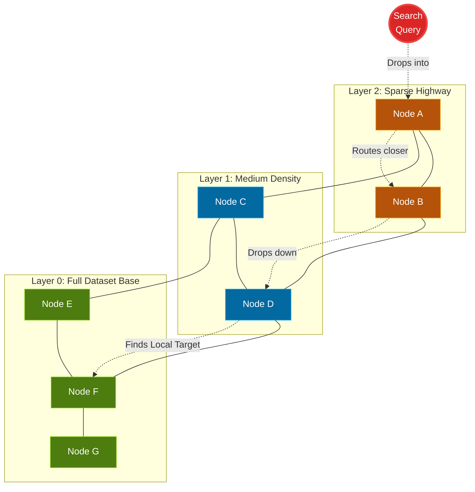

> **The 30-Second Version**
> Traditional keyword search fails when users search for concepts rather than exact words. Vector search solves this by converting text into high-dimensional arrays of numbers (embeddings) where semantic similarity equals geometric proximity. To query these massive datasets without $O(N)$ latency, production systems abandon exact KNN matching in favor of Approximate Nearest Neighbors (ANN) algorithms like HNSW, which trade a sliver of accuracy for massive speed gains. Getting all of this right in production requires solving embedding freshness, model selection, and the painfully difficult hybrid filtering problem.

## The practical scenarios you'll need to master

If you are interviewing for any machine learning infrastructure or backend platform role today, there is a good chance Vector Search comes up in some form. Here are some possible scenarios that could be discussed:

* **The Scale Problem**: You are asked to build semantic search over 500 million product reviews. This likely means explaining why exact K-Nearest Neighbors (KNN) is an $O(N)$ disaster and how **HNSW** graphs get around it.
* **The RAG Architecture Question**: You are asked to design a customer support bot that answers questions using internal company docs. The conversation will probably involve whiteboarding the full **Retrieval-Augmented Generation** pipeline and showing where Vector Search fits.
* **The Freshness Problem**: Your RAG pipeline keeps hallucinating because the embeddings are stale. Interviewers might push you on how to handle **Embedding Drift**, scheduled syncs vs. real-time upserts, and time-to-live (TTL) invalidation.
* **The Filtering Problem**: A user searches for "warm winter jackets" but needs to filter out anything over $100. This often leads into a discussion about the trade-offs between **Pre-filtering, Post-filtering, and Single-Stage** vector retrieval.

Before digging into the algorithms, we need to understand exactly where this tech sits in a modern AI application.

---

## Where Vector Search lives in RAG

Large Language Models are reasoning engines, but they suffer from complete amnesia regarding anything outside their original training data. If you ask GPT about your company's internal refund policy, it will confidently hallucinate an answer because that document never existed in its training corpus.

Retrieval-Augmented Generation (RAG) fixes this by injecting relevant, proprietary facts directly into the prompt *before* asking the LLM to answer. Instead of hoping the model "knows" the answer, you explicitly retrieve the three most relevant paragraphs from your internal knowledge base and paste them into the context window alongside the user's question.

Vector Search is the core retrieval infrastructure that makes this possible at sub-second latencies. Here is exactly how the pipeline flows when a user asks a question:

Both the user query and every document in your knowledge base must be encoded into the exact same mathematical space for this retrieval to work. That encoding step is where it all begins.

---

## Embeddings: Turning Meaning into Math

Traditional search engines like Elasticsearch rely heavily on BM25 or TF-IDF. These are extremely fast keyword algorithms. If you search for "apple", you get documents containing the string "a-p-p-l-e".

But if a user drops the messy query, *"how do I fix a leaky pipe under my sink?"*, BM25 fails catastrophically if the actual help document is titled *"Resolving Sub-basin Plumbing Drips"*. The semantic intent is identical, but the lexical overlap is exactly zero.

We fix this by running the raw text through an **Embedding Model**. This model (typically a transformer) projects the text into a high-dimensional vector space, often producing an array of 384, 768, or 1536 individual numbers. In this space, geometric distance equals semantic meaning. The vector array for "leaky pipe" is physically positioned right next to the array for "plumbing drips". Documents about cooking recipes sit in a completely different region of the space from documents about plumbing.

### Supervised vs. Unsupervised Embedding Models

When building this out, engineering teams face a critical fork in the road regarding which model generates these embeddings.

**The unsupervised (generic) path** is the fastest way to get started. You call an API endpoint (like OpenAI's `text-embedding-3-large` or Cohere's `embed-v3`) and get back dense vectors trained on massive, general-purpose internet data. These models learn representations purely from the statistical patterns in their training corpus without any human-labeled similarity pairs. For general-purpose RAG over public documentation or broad knowledge bases, these work surprisingly well out of the box.

**The supervised (fine-tuned) path** starts to matter when operating in highly specific domains. If you are building a search system over internal medical records, legal contracts, or proprietary engineering documentation, generic models tend to clump semantically different concepts together. The word "discharge" means something completely different in a medical context vs. a legal or military one, and a generic model has no way to prioritize your domain's meaning.

To solve this, teams fine-tune a smaller open-source model (like `sentence-transformers/all-MiniLM-L6-v2`) using **contrastive learning** on their proprietary data. You feed the model pairs of documents that your domain experts have labeled as "similar" or "not similar", and the model learns to push similar pairs closer together and dissimilar pairs further apart in the vector space. This produces significantly better retrieval precision for your specific use case, at the cost of additional training infrastructure and labeled data.

The decision is not binary. Many production systems start with a generic model, measure retrieval quality using metrics like Recall@K and MRR, and only invest in fine-tuning when those metrics prove insufficient for the business case.

---

## The O(N) Nightmare: Exact KNN

Once you have millions of document vectors sitting in memory, how do you actually search them?

The naive approach is **Exact K-Nearest Neighbors (KNN)**. You take your query vector, calculate the cosine distance between it and *every single document vector* in your database, sort the entire list, and return the top 10. 

This works perfectly for 10,000 PDFs. It completely falls apart when you have 100 million product catalogs. A single KNN query against 100 million 768-dimensional vectors can easily take seconds, locking up compute resources and trashing your API latencies.

If this is true, how is [Spotify running vector search across hundreds of millions of tracks and podcasts instantly](https://engineering.atspotify.com/2023/10/introducing-voyager-spotifys-new-nearest-neighbor-search-library/)? 

They don't do exact search. Nobody does at that scale.

---

## Trading Accuracy for Speed: ANN and HNSW

At this scale, most production systems skip exact search entirely and go straight to **Approximate Nearest Neighbors (ANN)**. The idea is to willingly trade a tiny fraction of accuracy (recall) for a massive, orders-of-magnitude increase in query speed.

There are dozens of ANN algorithms (Spotify originally built and open-sourced **Annoy**, Google developed **ScaNN**, Meta maintains **FAISS**), but **HNSW (Hierarchical Navigable Small World)** dominates modern production clusters. Spotify themselves moved from Annoy to an HNSW-based library called **Voyager** because HNSW consistently delivers better recall-vs-speed trade-offs at massive scale.

If you are asked to whiteboard how vector search scales, just draw a skiplist. HNSW builds a multi-layered graph of your dataset:

The top layer is very sparse, containing just a few node "highways." The algorithm drops your search query into the top layer, rapidly finds the closest general neighborhood by hopping across these sparse connections, and then drops down to the next, denser layer. It repeats this process until it hits the base layer (Layer 0), which contains every single vector. By the time it reaches the bottom, it has already navigated to the exact right neighborhood and only needs to scan a tiny local cluster instead of the entire dataset.

The result is $O(\log N)$ search complexity instead of $O(N)$. For a dataset of 100 million vectors, this is the difference between scanning 100,000,000 vectors vs scanning roughly 27.

The catch? HNSW requires holding that entire multi-layered graph structure in memory. For a billion 768-dimensional float32 vectors, that graph alone can consume terabytes of RAM. This is why vector database companies exist as an entire industry vertical. Managing this memory at scale is a non-trivial infrastructure problem.

---

## Production Realities: The things that actually break

Understanding HNSW will get you through the interview whiteboard phase, but actually maintaining this architecture in production introduces two additional headaches worth knowing about.

### 1. Keeping Embeddings Fresh

Vector embeddings represent frozen snapshots of text at the exact moment they were generated. If a product manager updates a wiki page, or your company ships a new pricing policy, the original embedding sitting in your vector database is instantly stale. This causes "embedding drift" where your RAG pipeline starts confidently feeding the LLM outdated company policies because the retriever has no idea the source document changed.

Treating this simply as an AI problem fails. It is a data engineering problem. You need robust pipelines that keep your vector index in sync with the source of truth.

There are three common strategies:

**Scheduled Re-embedding**: The simplest approach. Run a nightly cron job that re-processes your entire document corpus, generates fresh embeddings, and upserts them into the vector database. This works for slow-moving corpora (like an internal wiki that changes a few pages per week) but causes unacceptable staleness for anything time-sensitive.

**Event-Driven Upserts**: For more dynamic data, set up a change-data-capture (CDC) pipeline. When a source document is created, modified, or deleted, an event triggers an immediate re-embedding and **upsert** (update/insert) against the Vector DB API. The upsert replaces the specific stale vector ID with the freshly generated one. This achieves near real-time freshness but requires significantly more pipeline infrastructure.

**TTL (Time-to-Live) Auto-Deletion**: For rapidly expiring data like news feeds or stock analyses, assign TTL metadata to your embeddings. When the TTL expires, the vector is automatically purged from the index, preventing the retriever from surfacing information that is no longer valid. This works best as a safety net layered on top of event-driven upserts.

In practice, most production systems combine all three. Scheduled syncs as a baseline guarantee, event-driven upserts for freshness, and TTL as a safety net for data that must never go stale.

### 2. The Hybrid Filtering Dilemma

Users rarely do pure semantic search. More often, they do hybrid searches: *"Find me shoes that look like this image [Vector], but they MUST be size 10 and under $50 [Metadata]."*

Combining dense vector search with hard SQL-style filtering is one of the hardest systems problems in this entire stack. [Instacart wrote an excellent breakdown on why they had to completely re-architect their systems to solve this](https://tech.instacart.com/semantic-search-at-instacart-d84d12c82e66) after their initial FAISS-based ANN deployment struggled with real-time inventory filtering. You basically have three choices:

1.  **Pre-filtering:** You filter the metadata *first* (size = 10, price < $50), then run the vector search exclusively on the remaining pool. *The problem:* If your filter is too strict, you might eliminate so many vectors that the HNSW graph becomes disconnected and degrades to near-random results or returns zero matches entirely.
2.  **Post-filtering:** You do the fast vector search *first* (pulling, say, the top 1,000 dense matches by semantic similarity), then drop anything that does not match the metadata constraints. *The problem:* If the vector search did not pull enough size 10 shoes in its arbitrary top-k cut, your user gets three results instead of fifty. You have no control over what the ANN algorithm decides to surface.
3.  **Single-Stage (Integrated DBs):** You use a database specifically designed to weave metadata filtering directly into the ANN graph traversal step simultaneously, like Postgres with `pgvector`, Pinecone, or Weaviate. The database evaluates both the vector proximity *and* the metadata filters in a single pass. It works well, but locks you into that specific vendor's scaling constraints and query semantics.

There is no free lunch. When designing your architecture, you have to explicitly choose which of those three pains your product is most willing to tolerate. Instacart ultimately moved to a single-stage approach using `pgvector` in PostgreSQL, which let them interleave attribute filtering with ANN search in a way their previous FAISS setup simply could not support.

---

## Putting it together: The Interview Answer

If an interviewer asks you *"How would you design a scalable semantic search engine for 1 billion documents?"*, here is the skeleton you should draw on the whiteboard:

1.  **Ingest Pipeline:** Documents enter a processing queue. They are chunked (typically 256-512 tokens per chunk), run through an embedding model, and upserted into the vector database with metadata (source ID, timestamp, content hash).
2.  **Embedding Model:** Start with a generic model. Measure Recall@K. Fine-tune with contrastive learning only if domain-specific retrieval quality is insufficient.
3.  **Vector Index:** HNSW-based index (via a managed service like Pinecone, or self-hosted with Qdrant/Milvus). Shard across multiple nodes if the dataset exceeds single-machine memory.
4.  **Query Path:** User query is embedded with the same model, ANN search retrieves the Top-K chunks, metadata filters are applied (choose your pre/post/single-stage strategy), and the surviving chunks are injected into the LLM prompt alongside the original question.
5.  **Freshness Pipeline:** CDC pipeline watches the source of truth. Document mutations trigger re-embedding and upserts. TTL rules auto-purge expired vectors.

The beauty of this structure is that each layer can be independently scaled, swapped, or upgraded without tearing down the rest of the system.

---
*Note: This blog represents my technical views and production experience. I use AI-based tools to help with drafting and formatting to keep these posts coming daily.*
